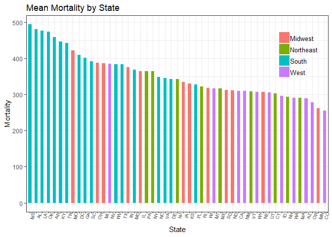
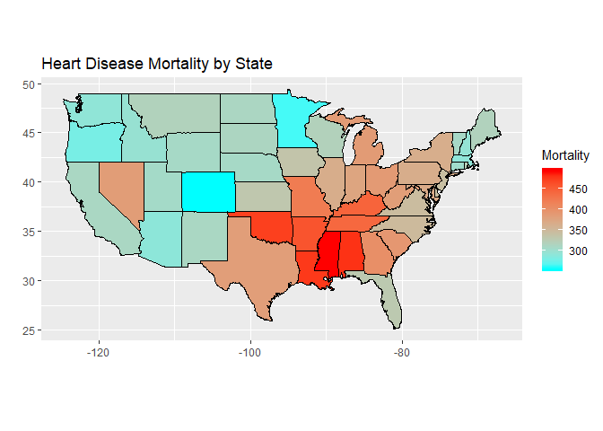
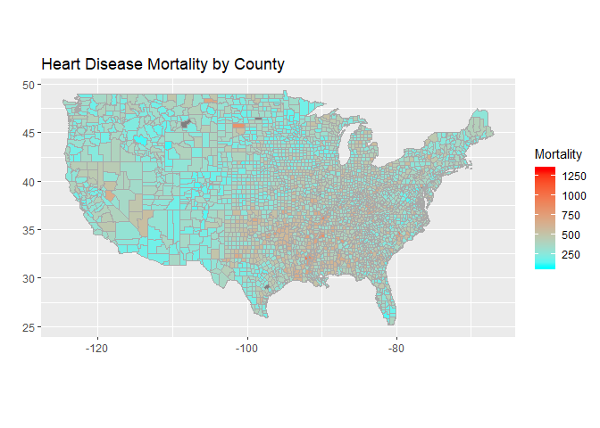
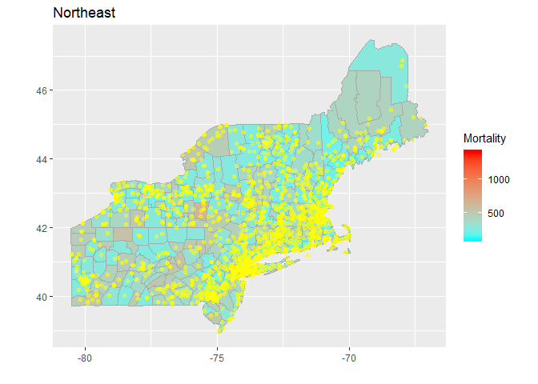
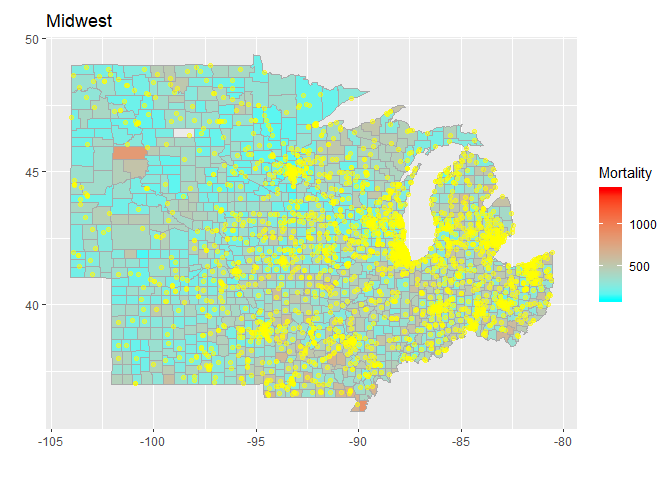
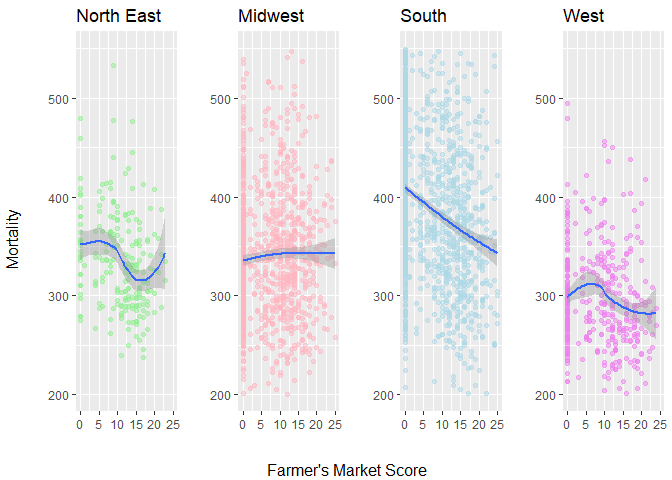
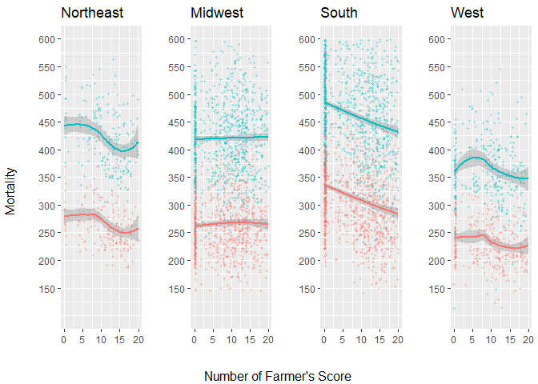
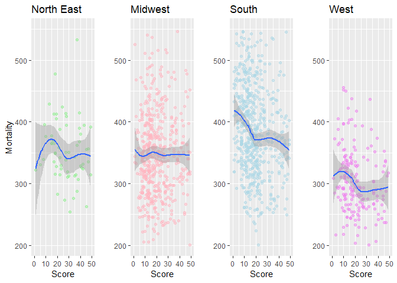

Heart Disease Mortality And Farmer's Market
===========================================

##### <i>Kyoosik Kim<br>July 2018</i>

### Abstract

I explore the data sets, 'Heart Disease Mortality' and 'Farmer's Market In The US', to study the relationship between them. The goal of this project is to capture a possible link of farmer's markets to heart disease mortality.

### Introduction

The Center For Disease Control And Prevention provides the data set 'Heart Disease Mortality Data Among US Adults (35+) by State/County in 2014' which is downloadable at <a href='https://catalog.data.gov/dataset/heart-disease-mortality-data-among-us-adults-35-by-state-territory-and-county-5fb7c'>DATA.GOV</a>. This data set contains the numbers of deaths from <a href='http://www.heart.org/HEARTORG/Conditions/What-is-Cardiovascular-Disease_UCM_301852_Article.jsp#.Wz57p9JKjIU'>Cardiovascular Disease</a>, also simply called heart disease, every 100,000 population by gender and race in state/county level. Another data set 'Farmer's Market In The US' is procured from The United States Department of Agriculture at <a href='https://www.ams.usda.gov/services/local-regional/farmers-markets-and-direct-consumer-marketing'>USDA</a>. 8.7k+ Farmer's markets are listed with information of state, exact locations and items. Even though the farmer's market data is collected between 2011 and 2018, most of the data was updated in 2015 which is almost the same year of that of the heart disease data. Also considering the small variability of the data over time, therefore, these two data sets can be compared without any serious errors.

I will be studying these data to discover trends of which states have more or less heart disease mortality and whether the states have a relationship with the number of farmer's markets. The importance of these questions stem from the fact that the number one cause of death in the US is none other than heart diseases.

It has been talked a lot about what causes heart diseases such as diet habits as interests in organic/fresh foods have been growing fast. Although people now believe that bad diets could cause heart diseases thanks to researches and education, there lacks the reverse thoughts of reducing the risks with good diets.

First step to answer these questions is to explore the data sets individually. I will look into the data, one by one, to see how they are distributed and visualize on the US map to gain some ideas where heart diseases or farmer's markets are found the most and least.

Second, I will join the two data sets to find a pattern between the heart disease mortality and the number of farmer's markets. This will be shown on the map for better understanding. The anticipated result is that the mortality is found to be lower where there are many farmer's markets than where there are less.

------------------------------------------------------------------------

### Preparation

``` r
# load packages
library(ggplot2)
library(gridExtra)
library(dplyr)
library(knitr)
library(stringi)
library(readr)
library(maps)
library(mapdata)
```

#### Define Function

``` r
# state names
state.name <- tolower(state.name)
state.name[51] <- "district of columbia"
state.abb[51] <- "DC"

# state divisions
NE <- c("CT","ME","MA","NH","RI","VT","NJ","NY","PA")
MW <- c("IN","IL","MI","OH","WI","IA","KS","MN","MO","NE","ND","SD")
SO <- c("DE","DC","FL","GA","MD","NC","SC","VA","WV","AL",
           "KY","MS","TN","AR","LA","OK","TX")
WE <- c("AZ","CO","ID","NM","MT","UT","NV","WY","CA","OR","WA")
region_list <- list(Northeast = NE, Midwest = MW, South = SO, West = WE)
```

Classifying the states follows [The US Census Region](https://www2.census.gov/geo/pdfs/maps-data/maps/reference/us_regdiv.pdf). These groups give a more intuitive idea to roughly understand which areas have the highest mortality and which areas do not.

``` r
region_division <- function(state) {
  if (state %in% NE) {
    return("North East")
  } else if (state %in% MW) {
    return("Midwest")
  } else if (state %in% SO) {
    return("South")
  } else {
    return("West")
  }
}
```

``` r
process_region <- function(df, state_list) {
  # state name for merging
  df$state <- state.name[match(trimws(df$state), state_list)]
  df$state <- tolower(df$state)
  df <- df[which(df$state != "alaska" & df$state != "hawaii"), ]
  # state abbreviation for text on axis
  df$state_abb <- state.abb[match(df$state, state.name)]
  df$state_abb <- factor(df$state_abb)
  
  # region
  df$division <- sapply(df$state_abb, function(x) region_division(x))
  df$division <- factor(df$division)
  
  # county
  df$county <- tolower(df$county)
  # remove unnecessary string or character
  df$county <- gsub("county", "", df$county)
  df$county <- gsub("city", "", df$county)
  df$county <- gsub("parish", "", df$county)
  df$county <- gsub("\\.", "", df$county)
  df$county <- gsub("\\'", "", df$county)
  # modify names for consistency
  df$county <- gsub("dekalb", "de kalb", df$county)
  df$county <- gsub("desoto", "de soto", df$county)
  df$county <- gsub("dupage", "du page", df$county)
  df$county <- gsub("laporte", "la porte", df$county)
  df$county <- gsub("yellowstone", "yellowstone national", df$county)
  # washington dc county
  df$county[which(df$state == "district of columbia")] <- "washington"

  # final screening
  df$state <- factor(trimws(df$state))
  df$county <- factor(trimws(df$county))
  
  return(df)
}
```

``` r
# audit values

# df <- df[complete.cases(df), ]
```

#### Load and Process the Data set

First, I need to read the Heart Disease Mortality data set and modify it to fit the format in which common variables are refined and named the same with the Farmer's market data set. Some other process here includes dropping variables such as race and gender. These could be useful for other analysis but not for the subject of this project.

``` r
# load heart disease mortality data
heart_mortality <- read.csv('../Data/Heart_Disease_Mortality_by_County.csv')

# select columns
heart_mortality <- subset(heart_mortality, GeographicLevel == 'County')
heart_mortality <- heart_mortality[, -c(1, 4:7, 9:13, 15, 17:19)]
heart_mortality <- heart_mortality[!is.na(heart_mortality$Data_Value), ]
# change column names
colnames(heart_mortality) <- c('state', 'county', 'mortality', 
                               'gender', 'race')

# process regional columns
heart_mortality <- process_region(heart_mortality, state.abb)

# mortality with "Overall" only
heart_mortality <- heart_mortality[(heart_mortality$gender == "Overall") 
                & (heart_mortality$race == "Overall"), ]
heart_mortality <- heart_mortality[, -c(4, 5)]

# show structure
str(heart_mortality)
```

    ## 'data.frame':    3109 obs. of  5 variables:
    ##  $ state    : Factor w/ 49 levels "alabama","arizona",..: 1 1 1 1 1 1 1 1 1 1 ...
    ##  $ county   : Factor w/ 1795 levels "abbeville","acadia",..: 144 79 86 96 159 217 227 238 284 305 ...
    ##  $ mortality: num  434 425 384 494 416 ...
    ##  $ state_abb: Factor w/ 49 levels "AL","AR","AZ",..: 1 1 1 1 1 1 1 1 1 1 ...
    ##  $ division : Factor w/ 4 levels "Midwest","North East",..: 3 3 3 3 3 3 3 3 3 3 ...

Next, the Farmer's Market data set is read and processed in the same way. The data set has a number of categorical variables of items that farmer's markets sell. Many of the items like tobu are so limitedly available as to be dropped. At last, the items that are general but can indicate freshness and organicity of a farmer's market are selected.

``` r
# load farmer's market data set
farmers_market <- read.csv('../Data/Farmers_Markets_by_County.csv')

# select columns
farmers_market <- farmers_market[, -c(1:9, 12:20, 23, 29, 59)]
farmers_market <- farmers_market[farmers_market$County != "", ]
farmers_market <- farmers_market[!is.na(farmers_market$x), ]
# change column names
colnames(farmers_market)[1:4] <- c('county', 'state', 'long', 'lat')
colnames(farmers_market) <- tolower(colnames(farmers_market))

# process regional columns
farmers_market$state <- tolower(farmers_market$state)
farmers_market <- process_region(farmers_market, state.name)

# one point for each item available
farmers_market$score <- 0
for (r in 1:nrow(farmers_market)) {
  for (c in 5:38) {
    if (farmers_market[r, c] == "Y") {
      farmers_market$score[r] = farmers_market$score[r] + 1
    }
  }
}

# show structure
str(farmers_market[1:10])
```

    ## 'data.frame':    8054 obs. of  10 variables:
    ##  $ county    : Factor w/ 1344 levels "abbeville","accomack",..: 187 327 83 840 338 840 836 1274 1274 155 ...
    ##  $ state     : Factor w/ 49 levels "alabama","arizona",..: 44 34 24 31 41 31 7 8 8 31 ...
    ##  $ long      : num  -72.1 -81.7 -94.3 -73.9 -86.8 ...
    ##  $ lat       : num  44.4 41.4 37.5 40.8 36.1 ...
    ##  $ credit    : Factor w/ 2 levels "N","Y": 2 2 2 1 2 2 1 2 2 2 ...
    ##  $ wic       : Factor w/ 2 levels "N","Y": 2 1 1 1 1 2 1 2 2 1 ...
    ##  $ wiccash   : Factor w/ 2 levels "N","Y": 1 1 1 2 1 1 1 2 2 2 ...
    ##  $ sfmnp     : Factor w/ 2 levels "N","Y": 2 2 1 2 1 2 1 2 2 2 ...
    ##  $ snap      : Factor w/ 2 levels "N","Y": 1 1 1 1 2 2 2 2 2 2 ...
    ##  $ bakedgoods: Factor w/ 2 levels "N","Y": 2 2 2 2 2 2 1 2 2 1 ...

Lastly, the population data set is brought as a supplement. Because the heart disease mortality is based on 2014, it would make the best sense to remove other years from the population matrix. Also, county and state should be seperated to be aligned with the other data sets.

``` r
# load population data set
population_county <- read.csv('../Data/PEP_2014_PEPANNRES_with_ann.csv')

# select and change column names
population_county <- population_county[-1, c(3, 10)]
colnames(population_county) <- c('geo_name', 'population')

# process regional columns
population_county$geo_name <- tolower(population_county$geo_name)
geo_split <- strsplit(as.character(population_county$geo_name), split = ',')
population_county$county <- sapply(geo_split, '[', 1)
population_county$state <- sapply(geo_split, '[', 2)
population_county <- process_region(population_county, state.name)

# add population column onto farmer's market data set
population_county$population <- with(population_county,
                                     as.numeric(levels(population))[population])
population_county <- population_county[, -c(1,5,6)]
farmers_market <- merge(farmers_market, population_county,
                        by = c("state", "county"))

# show structure
rm(geo_split)
str(population_county)
```

    ## 'data.frame':    3108 obs. of  3 variables:
    ##  $ population: num  55395 200111 26887 22506 57719 ...
    ##  $ county    : Factor w/ 1796 levels "abbeville","acadia",..: 79 86 96 144 159 217 227 238 284 305 ...
    ##  $ state     : Factor w/ 49 levels "alabama","arizona",..: 1 1 1 1 1 1 1 1 1 1 ...

------------------------------------------------------------------------

### Exploring the Data

In this section, I will look into the two data sets individually to see how they are distributed and what trends they have in general before they are merged for the final analysis.

#### Part I: Histogram

Histogram helps you understand the distribution of your data set. I focus on heart disease mortality so I want to get an idea how each county's mortality is laid out. As it turns out, it could be said that they are normally distributed. This should be noted for later use such as removal of outliers. Since it has tails on both sides, I could cut off 25% and 75% as an instance.

##### Histogram of Heart Disease Mortality

``` r
heart_disease_overall_hist <- ggplot(heart_mortality, aes(mortality)) +
  geom_histogram(binwidth = 20, color = 'gray', fill = 'lightblue') +
  ggtitle("Heart Disease Mortality in the US (2014)") +
  xlab("Number of Deaths per 100,000") + ylab("Counties") +
  scale_x_continuous(limits = c(0, 700), breaks = seq(0, 700, 100))

heart_disease_overall_hist
```


In fact, it is slightly skewed with the median on the left of the mean. Also, the range is quite large with the min and max set far. However, most of values seem to be normally centered, considering 1st and 3rd quantile.

``` r
summary(heart_mortality$mortality)
```

    ##    Min. 1st Qu.  Median    Mean 3rd Qu.    Max. 
    ##   108.6   298.8   349.7   362.0   411.6  1096.5

##### Highest to Lowest Heart Disease Mortality by State

The plot is useful to have a rough feeling of which area shows the highest mortality and the other way around. The data set should be grouped in four areas first and then drawn by state.

``` r
# mean mortality by state and division
mortality_state <- heart_mortality %>%
  group_by(state_abb, state, division) %>%
  summarise(mortality_mean = mean(mortality)) %>%
  arrange(state_abb)

# mean mortality
mortality_state_bar <- ggplot(mortality_state, 
                              aes(reorder(state_abb, -mortality_mean), 
                                  mortality_mean,
                                  fill = division)) +
  geom_bar(stat = 'identity', width = 0.5) +
  ggtitle("Mean Mortality by State") +
  xlab("State") + ylab("Mortality")
  
mortality_state_bar + theme_bw() + 
  theme(axis.text.x = element_text(size = 7, angle = 75),
        legend.title = element_blank(),
        legend.text = element_text(size = 10),
        legend.position = c(0.9,0.8),
        legend.background = element_rect(fill = alpha('white', 0)))
```


Like seen on the bar plot, South is seemingly at highest the risk. Kentuchy comes the seventh but note that the Midwest state is right above Tennessee in South. This is a quite well-known fact regarding [racial factors](https://newsarchive.heart.org/heart-disease-kills-more-southerners-than-any-other-disease/) and [Southern diet](https://www.mensjournal.com/food-drink/what-southern-diet-actually-and-three-ways-its-killing-you/) known for a lot of meat. The regional mortality can be found again as below.

``` r
mortality_region_rank <- aggregate(mortality_state[, "mortality_mean"],
                                   list(mortality_state$division), mean)
kable(mortality_region_rank[order(-mortality_region_rank$mortality_mean), ], 
      col.names = c("Region", "Mean Mortality"), format = "html")
```

<table>
<thead>
<tr>
<th style="text-align:left;">
</th>
<th style="text-align:left;">
Region
</th>
<th style="text-align:right;">
Mean Mortality
</th>
</tr>
</thead>
<tbody>
<tr>
<td style="text-align:left;">
3
</td>
<td style="text-align:left;">
South
</td>
<td style="text-align:right;">
402.2686
</td>
</tr>
<tr>
<td style="text-align:left;">
1
</td>
<td style="text-align:left;">
Midwest
</td>
<td style="text-align:right;">
335.9101
</td>
</tr>
<tr>
<td style="text-align:left;">
2
</td>
<td style="text-align:left;">
North East
</td>
<td style="text-align:right;">
313.6581
</td>
</tr>
<tr>
<td style="text-align:left;">
4
</td>
<td style="text-align:left;">
West
</td>
<td style="text-align:right;">
300.0910
</td>
</tr>
</tbody>
</table>
##### Most and Least Farmer's Market Counts by State

As with Heart Disease Mortality, Farmer's Market can be drawn on bar plot. The same condition is given to the data set.

``` r
# number of farmer's market by state and division
farmers_market_state <- farmers_market %>%
  group_by(state_abb, state, division) %>%
  summarise(count = n()) %>%
  arrange(state_abb)

# number of farmer's market
farmers_market_bar <- ggplot(farmers_market_state, 
                             aes(reorder(state_abb, -count), 
                                 count, fill = division)) +
  geom_bar(stat = 'identity', width = 0.5) +
  ggtitle("Farmer's Markets by State") +
  xlab("State") + ylab("Count")

farmers_market_bar + theme_bw() + 
  theme(axis.text.x = element_text(size = 7, angle = 75),
        legend.title = element_blank(),
        legend.text = element_text(size = 10),
        legend.position = c(0.9,0.8),
        legend.background = element_rect(fill = alpha('white', 0)))
```


As expected, the largest state California comes first followed by New York, the third largest. Even though there seems to be a pattern of population, this is not true with so many exceptions including Texas not even in top 10. One trend is that the last half are mostly states in South and some part of West in [Mountain Time Zone](https://www.timetemperature.com/tzus/mountain_time_zone.shtml).

``` r
farmers_market_region <- aggregate(farmers_market_state[, "count"], 
                                   list(farmers_market_state$division), mean)
kable(farmers_market_region[order(-farmers_market_region$count), ],
      col.names = c("Region", "Count"), format = "html")
```

<table>
<thead>
<tr>
<th style="text-align:left;">
</th>
<th style="text-align:left;">
Region
</th>
<th style="text-align:right;">
Count
</th>
</tr>
</thead>
<tbody>
<tr>
<td style="text-align:left;">
2
</td>
<td style="text-align:left;">
North East
</td>
<td style="text-align:right;">
203.8889
</td>
</tr>
<tr>
<td style="text-align:left;">
1
</td>
<td style="text-align:left;">
Midwest
</td>
<td style="text-align:right;">
200.8333
</td>
</tr>
<tr>
<td style="text-align:left;">
4
</td>
<td style="text-align:left;">
West
</td>
<td style="text-align:right;">
142.7273
</td>
</tr>
<tr>
<td style="text-align:left;">
3
</td>
<td style="text-align:left;">
South
</td>
<td style="text-align:right;">
136.4706
</td>
</tr>
</tbody>
</table>
Recalling that California has the most farmer's market in number, West is not expect to come third with slightly more than South does. This is probably because of other states in West thinly populated. Another view in a different angle is to adjust it to population.

``` r
# total population by state
population_state <- population_county %>%
  group_by(state) %>%
  summarise(population = sum(population)) %>%
  arrange(state)
# number of farmer's market per 100,000
farmers_market_state <- merge(farmers_market_state, population_state, by = "state")
farmers_market_state$per_100k <- with(farmers_market_state, 
                                      count/population*100000)
farmers_market_popl_adj_bar <- ggplot(farmers_market_state, 
                                      aes(reorder(state_abb, -per_100k), 
                                          per_100k, 
                                          fill = division)) +
  geom_bar(stat = 'identity', width = 0.5) +
  ggtitle("Farmer's Markets per 100,000 by State") +
  xlab("State") + ylab("Count")

farmers_market_popl_adj_bar + theme_bw() + 
  theme(axis.text.x = element_text(size = 7, angle = 75),
        legend.title = element_blank(),
        legend.text = element_text(size = 10),
        legend.position = c(0.9,0.8),
        legend.background = element_rect(fill = alpha('white', 0)))
```



Now, the other states in West are relatively in the front. However, it needs more consideration whether to take population into account this way because it is unclear if population is highly related to the number of farmer's markets. Either way, the four areas are ranked the same with South the least.

``` r
farmers_market_division_adj <- aggregate(farmers_market_state[, "per_100k"], 
                                         list(farmers_market_state$division), mean)
kable(farmers_market_division_adj[order(-farmers_market_division_adj$x), ],
      col.names = c("Region", "Count"), format = "html")
```

<table>
<thead>
<tr>
<th style="text-align:left;">
</th>
<th style="text-align:left;">
Region
</th>
<th style="text-align:right;">
Count
</th>
</tr>
</thead>
<tbody>
<tr>
<td style="text-align:left;">
2
</td>
<td style="text-align:left;">
North East
</td>
<td style="text-align:right;">
5.225179
</td>
</tr>
<tr>
<td style="text-align:left;">
1
</td>
<td style="text-align:left;">
Midwest
</td>
<td style="text-align:right;">
4.471810
</td>
</tr>
<tr>
<td style="text-align:left;">
4
</td>
<td style="text-align:left;">
West
</td>
<td style="text-align:right;">
3.152899
</td>
</tr>
<tr>
<td style="text-align:left;">
3
</td>
<td style="text-align:left;">
South
</td>
<td style="text-align:right;">
2.899423
</td>
</tr>
</tbody>
</table>
#### Part II: Visualization on Map

The findings made by now can be plotted on the real map. In the next, the state map and the county map will be provided with mortality and farmer's market data.

##### Heart Disease Mortality by State

``` r
state_map <- merge(map_data("state"), mortality_state, 
                   by.x = "region", by.y = "state", all.x = TRUE)

# mean mortality by state
mortality_state_map <- ggplot(data = state_map) +
  geom_polygon(aes(long, lat, fill = mortality_mean, group = group), 
               color = "black", size = 0.1) +
  labs(x = "", y = "") +
  coord_fixed(1.3) +
  scale_fill_gradientn(colours = rev(rainbow(2)), guide = "colorbar")

mortality_state_map +
  labs(title = "Heart Disease Mortality by State")
```


As confirmed with statistics, South is the highest in heart disease mortality. North East and West are generally low, so is Midwest except for Missouri and Kentuchy neighboring South.

##### Heart Disease Mortality by County

``` r
county_map <- merge(map_data("county"), heart_mortality,
                    by.x = c('region', 'subregion'), 
                    by.y = c('state', 'county'),
                    all.x = TRUE)
county_map <- county_map[order(county_map$order), ]

# mortality by county
mortality_county_map <- ggplot(data = county_map) +
  geom_polygon(aes(long, lat, fill = mortality, group = group), 
               color = "darkgray", size = 0.1) +
  labs(x = "", y = "") +
  coord_fixed(1.3) +
  scale_fill_gradientn(colours = rev(rainbow(2)), guide = "colorbar")

mortality_county_map +
  labs(title = "Heart Disease Mortality by County")
```



County map shows finer version of data. In fact, this is the map with raw data since Heart Disease Mortality is set by county. The dark gray is missing in the mortality data set. I am leaving them empty rather than artificially filling the data because they will be excluded in the process of analysis.

##### Heart Disease Mortality and Farmer's Market

``` r
# farmer's market location points
farmers_martket_loc1 <- data.frame(
  lat = as.vector(farmers_market$lat),
  long = as.vector(farmers_market$long)
)

mortality_county_map +
  labs(title = "Heart Disease Mortality with Farmer's Market") +
  geom_point(data = farmers_martket_loc1, aes(x = long, y = lat), 
             color = "yellow", size = 0.01, alpha = 0.2)
```



Now, the county map are plotted with farmer's markets which are yellow dots. North East seems to have the most farmer's markets followed by Midwest and Far West. One thing to note here is that South obviously has more farmer's markets than West, however, South is much higher than West in mortaliy. Taking population into account might a good adjustment.

##### Heart Disease Mortality and Farmer's Market

``` r
farmers_martket_loc2 <- data.frame(
  lat = as.vector(farmers_market$lat),
  long = as.vector(farmers_market$long),
  size = as.vector(farmers_market$population/100000)
)

mortality_county_map +
  labs(title = "Heart Disease Mortality with Population Adjusted Farmer's Market") +
  geom_point(data = farmers_martket_loc2, aes(x = long, y = lat), 
             color = "yellow", size = 0.1/farmers_martket_loc2$size, alpha = 0.2)
```


With farmer's markets adjusted to unit of per 100,000 population, it seems like West has more farmer's markets but South still has many yellow dots. It would be too soon to claim that heart disease mortality and number of farmer's market are correlated. It is necessary to take a closer look at the map.

``` r
# receive reginal division as parameter
farmers_market_loc_division <- function(division) {
  # filter parameter division
  farmers_market_division <- farmers_market[farmers_market$division == division, ]
  
  farmers_martket_loc <- data.frame(
    lat = as.vector(farmers_market_division$lat),
    long = as.vector(farmers_market_division$long),
    size = as.vector(farmers_market_division$population/100000)
  )  
  
  # draw reginal map
  p <- ggplot(data = county_map[which(county_map$division == division), ]) +
    geom_polygon(aes(long, lat, fill = mortality, group = group), 
                 color = "darkgray", size = 0.1) +
    labs(x = "", y = "") +
    coord_fixed(1.3) +
    scale_fill_gradientn(colours = rev(rainbow(2)), limits = c(100, 1100),
                         guide = "colorbar") +
    geom_point(data = farmers_martket_loc, aes(x = long, y = lat), 
               color = "yellow", alpha = 0.75,
               size = 0.1/farmers_martket_loc$size)
  
  return(p)
}
```

The function does the job of closing up each region, still population adjusted. First to see North East, mortality is mostly very low and there are many farmer's markets which are small dots in the highly populated region.

``` r
farmers_market_loc_division("North East")
```



Midwest also has a lot of farmer's markets with decent mortality. There are some red parts that have less or smaller dots in the bottom area.

``` r
farmers_market_loc_division("Midwest")
```



Except for Texas area, it is quite clear that areas in red have smaller dots or even none. This pattern is strong in the middle around Louisiana and Mississippi.

``` r
farmers_market_loc_division("South")
```


West shows blue in the most of areas. There are some large yellow dots where population density is extremely low. Nevada has relatively red counties that have zero or one farmer's market.

``` r
farmers_market_loc_division("West")
```


##### Correlation between Heart Disease Mortality and Farmer's Market

With the idea gained from visualization, it is time to pull the statistics. Let's take a look at the basic statistics first. 1st quantile is same as minimum, suggesting there are just so many counties with only one farmer's market. Also, it is skewed to the right and maximum is far out of normal range. I would probably cut off only the right tail to remove outliers.

``` r
farmers_market_count <- farmers_market %>%
  group_by(state, county) %>%
  summarise(farmers_market_count = n()) %>%
  arrange(state, county)

summary(farmers_market_count$farmers_market_count)
```

    ##    Min. 1st Qu.  Median    Mean 3rd Qu.    Max. 
    ##   1.000   1.000   2.000   3.683   4.000 125.000

To see the relationship, the number of farmer's market in each county is added onto heart disease mortality. Note that Heart Disease Mortality misses just a few counties, but there are many counties that do not appear on Farmer's Market. Most of these counties are very small and thought to have none. Nonetheless, I will count them as NA even though I enter zero for convenience.

``` r
heart_mortality <- merge(heart_mortality, farmers_market_count, 
                         by = c("state", "county"), all.x = T)
heart_mortality <- merge(heart_mortality, population_county,
                         by = c("state", "county"), all.x = T)
heart_mortality$farmers_market_count[is.na(heart_mortality$farmers_market_count)] <- 0

# total number of farmer's markets
p_farmers_market_raw <- ggplot(heart_mortality, 
                               aes(farmers_market_count, 
                                   mortality)) +
  geom_point(aes(color = division), alpha = 0.1, size = 1) + 
  geom_smooth() + 
  labs(title = "Total Number",
       x = "Farmer's Market Total", y = "Mortality per 100,000") +
  scale_x_continuous(limits = c(0, 30), breaks = seq(0, 30, 5)) +
  scale_y_continuous(limits = c(100, 600), breaks = seq(150, 600, 50))

# population adjusted
p_farmers_market_pop_adj <- ggplot(heart_mortality, 
                                   aes(farmers_market_count/population*100000,
                                       mortality)) +
  geom_point(aes(color = division), alpha = 0.1, size = 1) + 
  geom_smooth() + 
  labs(title = "Population Adjusted",
       x = "Farmer's Market per 100,000", y = "Mortality per 100,000") +
  scale_x_continuous(limits = c(0, 30), breaks = seq(0, 30, 5)) +
  scale_y_continuous(limits = c(100, 600), breaks = seq(150, 600, 50))

grid.arrange(p_farmers_market_raw, p_farmers_market_pop_adj, ncol = 2)
```


Mortality, the Y-value, is widely spread at X-value zero. This is not surprising if you consider two small towns with no farmer's market, one in West and the other in South, which show totally different heart disease mortality being influenced by other factor than farmer's market. Note that higher Y values are blue of South. The first has the trend going down up to 15 or so and going up slightly from there. The second is the population adjusted version for fair comparison but it shows strange ups and downs. To reason why, I am calculating the correlation between mortality and population.

``` r
with(heart_mortality, cor.test(mortality, population))
```

    ## 
    ##  Pearson's product-moment correlation
    ## 
    ## data:  mortality and population
    ## t = -7.4393, df = 3116, p-value = 1.302e-13
    ## alternative hypothesis: true correlation is not equal to 0
    ## 95 percent confidence interval:
    ##  -0.16643260 -0.09745085
    ## sample estimates:
    ##        cor 
    ## -0.1321017

The value is -0.13 which means mortality and population are weakly related. Consequently, considering population is not fair but only adds more noises. Therefore, I choose to use the total number of farmer's market for analysis.

``` r
mean_mortality_farmers_market_count <- heart_mortality %>%
  group_by(farmers_market_count) %>%
  summarise(mean_mortality = median(mortality)) %>%
  arrange(farmers_market_count)

kable(mean_mortality_farmers_market_count[1:16, ], format = "html")
```

<table>
<thead>
<tr>
<th style="text-align:right;">
farmers\_market\_count
</th>
<th style="text-align:right;">
mean\_mortality
</th>
</tr>
</thead>
<tbody>
<tr>
<td style="text-align:right;">
0
</td>
<td style="text-align:right;">
372.40
</td>
</tr>
<tr>
<td style="text-align:right;">
1
</td>
<td style="text-align:right;">
363.50
</td>
</tr>
<tr>
<td style="text-align:right;">
2
</td>
<td style="text-align:right;">
345.30
</td>
</tr>
<tr>
<td style="text-align:right;">
3
</td>
<td style="text-align:right;">
338.60
</td>
</tr>
<tr>
<td style="text-align:right;">
4
</td>
<td style="text-align:right;">
328.90
</td>
</tr>
<tr>
<td style="text-align:right;">
5
</td>
<td style="text-align:right;">
323.70
</td>
</tr>
<tr>
<td style="text-align:right;">
6
</td>
<td style="text-align:right;">
301.20
</td>
</tr>
<tr>
<td style="text-align:right;">
7
</td>
<td style="text-align:right;">
321.70
</td>
</tr>
<tr>
<td style="text-align:right;">
8
</td>
<td style="text-align:right;">
317.25
</td>
</tr>
<tr>
<td style="text-align:right;">
9
</td>
<td style="text-align:right;">
300.45
</td>
</tr>
<tr>
<td style="text-align:right;">
10
</td>
<td style="text-align:right;">
299.65
</td>
</tr>
<tr>
<td style="text-align:right;">
11
</td>
<td style="text-align:right;">
273.30
</td>
</tr>
<tr>
<td style="text-align:right;">
12
</td>
<td style="text-align:right;">
297.40
</td>
</tr>
<tr>
<td style="text-align:right;">
13
</td>
<td style="text-align:right;">
276.70
</td>
</tr>
<tr>
<td style="text-align:right;">
14
</td>
<td style="text-align:right;">
314.20
</td>
</tr>
<tr>
<td style="text-align:right;">
15
</td>
<td style="text-align:right;">
310.80
</td>
</tr>
</tbody>
</table>
Getting rid of deviations, the mean values of farmer's market count appears to decline as they are more. However, the trend starts to rise around 14 and 15. In addition, recall that zero is actually NA, but it seems like they are likely to be zero in the trend. For calculating correlation in the next, I will not include NAs, though.

``` r
with(subset(heart_mortality, farmers_market_count > 0 & farmers_market_count < 14), 
     cor.test(mortality, farmers_market_count))
```

    ## 
    ##  Pearson's product-moment correlation
    ## 
    ## data:  mortality and farmers_market_count
    ## t = -12.16, df = 2111, p-value < 2.2e-16
    ## alternative hypothesis: true correlation is not equal to 0
    ## 95 percent confidence interval:
    ##  -0.2952640 -0.2155517
    ## sample estimates:
    ##        cor 
    ## -0.2558427

The correlation is -0.25 which is not quite high enough due to the reasons I suspect that the deviations are too high. This again comes from other factors that give rise to discrepancies. For example, some county is low in mortality with no farmer's market because it is located in North East. On the contrary, there could be some county in the other area with a few farmer's market but is high in mortality because of regional or racial factors. These are contradictory, resulting in lowering the correlation.

------------------------------------------------------------------------

##### Considering Categorical Data

One way to get closer to more fair correlation is to consider categorical data given in Farmer's Market. There are 34 categories from credit card availability to different foods on sale. These are all indicators to the size of individual farmer's market. I have already given each of them one point if the item is available and set aside the results as score variable.

``` r
farmers_market_score <- farmers_market %>%
  group_by(state, county) %>%
  summarise(farmers_market_score = mean(score)) %>%
  arrange(state, county)

# normality
ggplot(farmers_market_score, aes(farmers_market_score)) +
  geom_histogram(binwidth = 1, color = 'gray', fill = 'lightblue') +
  labs(title = "Farmer's Market Score", x = "Score", y = "Count")
```



Luckily, the distribution is almost normal excluding at zero. While this many zero-score farmer's market was not expected, they are meaningful little to nothing because they are highly likely very small (none available out of 34 items listed). I will cut them off with some of left and right tails for analysis.

``` r
heart_mortality <- merge(heart_mortality, farmers_market_score, 
                         by = c("state", "county"), all.x = T)
heart_mortality$farmers_market_score[is.na(heart_mortality$farmers_market_score)] <- 0

ggplot(heart_mortality[heart_mortality$farmers_market_score > 0, ], 
       aes(farmers_market_score, mortality)) +
  geom_point(aes(color = division), alpha = 0.1) + 
  geom_smooth() +
  labs(title = "Farmer's Market Score", x = "Score", y = "Mortality") +
  scale_x_continuous(limits = c(0, 25), breaks = seq(0, 25, 5)) +
  scale_y_continuous(limits = c(200, 600), breaks = seq(200, 600, 100))
```


Even though the trend line is consistently declining, the deviation is apparently too big. The score is the mean of the whole farmer's markets in the same county. I think this spread dots on the plot by removing the effect of number of farmer's market. This makes sense because a county with only one farmer's market with a good score would looks better than another county with a couple of farmer's markets with full scores but also with several very small farmer's markets. To add the quantative effect, I am creating a varible to combine them as below, eventually having the same value of sum of scores instead of mean of scores.

``` r
heart_mortality$final <- with(heart_mortality, farmers_market_count*farmers_market_score)

ggplot(heart_mortality[heart_mortality$final > 0, ], aes(final)) +
  geom_histogram(binwidth = 1, fill = "lightslateblue", color = "gray") +
  coord_cartesian(xlim = c(0, 80), ylim = c(1, 80)) +
  scale_x_continuous(limits = c(0, 100), breaks = seq(0, 100, 5))
```



``` r
with(heart_mortality[ heart_mortality$farmers_market_count < 15 & heart_mortality$farmers_market_score > 0 & heart_mortality$farmers_market_score < 30 & heart_mortality$population > 0 & heart_mortality$division == "South" , ], cor.test(mortality, final))
```

    ## 
    ##  Pearson's product-moment correlation
    ## 
    ## data:  mortality and final
    ## t = -9.7082, df = 704, p-value < 2.2e-16
    ## alternative hypothesis: true correlation is not equal to 0
    ## 95 percent confidence interval:
    ##  -0.4070789 -0.2768451
    ## sample estimates:
    ##       cor 
    ## -0.343613

``` r
summary(heart_mortality[heart_mortality$final > 0, "final"])
```

    ##    Min. 1st Qu.  Median    Mean 3rd Qu.    Max. 
    ##    1.00   14.00   23.00   54.42   52.00 1175.00

``` r
heart_mortality <- subset(heart_mortality, mortality > 200 & mortality < 550)
heart_mortality <- subset(heart_mortality, final > 0 & final < 50)
```

``` r
p_northeast <- ggplot(heart_mortality[heart_mortality$division == "North East", ], 
                       aes(final, mortality)) +
  geom_point(color = "lightgreen", alpha = 0.5) + 
  geom_smooth() +
  labs(title = "North East", x = "Score", y = "Mortality") +
  scale_x_continuous(limits = c(0, 50), breaks = seq(0, 50, 10)) +
  scale_y_continuous(limits = c(200, 550), breaks = seq(200, 550, 100))

p_midwest <- ggplot(heart_mortality[heart_mortality$division == "Midwest", ], 
                       aes(final, mortality)) +
  geom_point(color = "lightpink", alpha = 0.5) + 
  geom_smooth() +
  labs(title = "Midwest", x = "Score", y = "") +
  scale_x_continuous(limits = c(0, 50), breaks = seq(0, 50, 10)) +
  scale_y_continuous(limits = c(200, 550), breaks = seq(200, 550, 100))

p_south <- ggplot(heart_mortality[heart_mortality$division == "South", ], 
                       aes(final, mortality)) +
  geom_point(color = "lightblue", alpha = 0.5) + 
  geom_smooth() +
  labs(title = "South", x = "Score", y = "") +
  scale_x_continuous(limits = c(0, 50), breaks = seq(0, 50, 10)) +
  scale_y_continuous(limits = c(200, 550), breaks = seq(200, 550, 100))

p_west <- ggplot(heart_mortality[heart_mortality$division == "West", ], 
                       aes(final, mortality)) +
  geom_point(color = "violet", alpha = 0.5) + 
  geom_smooth() +
  labs(title = "West", x = "Score", y = "") +
  scale_x_continuous(limits = c(0, 50), breaks = seq(0, 50, 10)) +
  scale_y_continuous(limits = c(200, 550), breaks = seq(200, 550, 100))

grid.arrange(p_northeast, p_midwest, p_south, p_west, ncol = 4)
```



------------------------------------------------------------------------

### Conclusion
