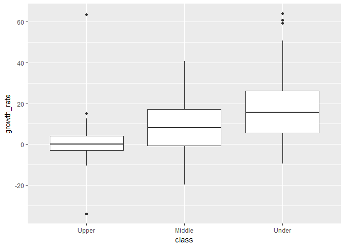

Lesson3 Project
================

### Import libraries

``` r
library(xlsx)
library(ggplot2)
library(tidyr)
library(dplyr)
library(gridExtra)
```

### Data from Gapminder: GDP/capita (US$, inflation-adjusted) by World Bank

``` r
gdp_capita <- read.csv('../Data/GDPpercapitaconstant2000US.csv')
colnames(gdp_capita)[1] <- "Country"
head(gdp_capita)
```

    ##                 Country    X1960    X1961   X1962    X1963    X1964
    ## 1              Abkhazia       NA       NA      NA       NA       NA
    ## 2           Afghanistan       NA       NA      NA       NA       NA
    ## 3 Akrotiri and Dhekelia       NA       NA      NA       NA       NA
    ## 4               Albania       NA       NA      NA       NA       NA
    ## 5               Algeria 1280.385 1085.415 855.948 1128.416 1170.324
    ## 6        American Samoa       NA       NA      NA       NA       NA
    ##      X1965    X1966    X1967    X1968    X1969   X1970    X1971    X1972
    ## 1       NA       NA       NA       NA       NA      NA       NA       NA
    ## 2       NA       NA       NA       NA       NA      NA       NA       NA
    ## 3       NA       NA       NA       NA       NA      NA       NA       NA
    ## 4       NA       NA       NA       NA       NA      NA       NA       NA
    ## 5 1215.016 1127.614 1200.558 1291.864 1359.491 1436.13 1235.664 1527.646
    ## 6       NA       NA       NA       NA       NA      NA       NA       NA
    ##      X1973   X1974    X1975   X1976    X1977    X1978    X1979    X1980
    ## 1       NA      NA       NA      NA       NA       NA       NA       NA
    ## 2       NA      NA       NA      NA       NA       NA       NA       NA
    ## 3       NA      NA       NA      NA       NA       NA       NA       NA
    ## 4       NA      NA       NA      NA       NA       NA       NA 1060.685
    ## 5 1538.306 1603.35 1632.296 1714.07 1747.665 1848.438 1923.291 1876.076
    ## 6       NA      NA       NA      NA       NA       NA       NA       NA
    ##      X1981    X1982    X1983    X1984    X1985    X1986    X1987    X1988
    ## 1       NA       NA       NA       NA       NA       NA       NA       NA
    ## 2       NA       NA       NA       NA       NA       NA       NA       NA
    ## 3       NA       NA       NA       NA       NA       NA       NA       NA
    ## 4 1099.513 1110.512 1101.336 1065.235 1059.866 1091.561 1054.248 1013.629
    ## 5 1869.621 1924.614 1963.365 2008.472 2020.087 1969.764 1902.061 1833.153
    ## 6       NA       NA       NA       NA       NA       NA       NA       NA
    ##      X1989     X1990     X1991     X1992     X1993     X1994     X1995
    ## 1       NA        NA        NA        NA        NA        NA        NA
    ## 2       NA        NA        NA        NA        NA        NA        NA
    ## 3       NA        NA        NA        NA        NA        NA        NA
    ## 4 1092.475  977.7655  687.9919  643.2858  714.2414  784.5831  899.7829
    ## 5 1864.713 1832.7434 1766.6608 1755.9737 1680.3799 1630.3815 1660.0042
    ## 6       NA        NA        NA        NA        NA        NA        NA
    ##       X1996    X1997    X1998    X1999    X2000    X2001    X2002    X2003
    ## 1        NA       NA       NA       NA       NA       NA       NA       NA
    ## 2        NA       NA       NA       NA       NA       NA       NA       NA
    ## 3        NA       NA       NA       NA       NA       NA       NA       NA
    ## 4  990.6532  895.561 1013.514 1118.172 1200.137 1281.843 1313.723 1381.041
    ## 5 1698.3338 1690.238 1750.651 1781.142 1794.405 1814.415 1871.922 1971.513
    ## 6        NA       NA       NA       NA       NA       NA       NA       NA
    ##      X2004    X2005    X2006    X2007    X2008    X2009    X2010    X2011
    ## 1       NA       NA       NA       NA       NA       NA       NA       NA
    ## 2       NA       NA       NA       NA       NA       NA       NA       NA
    ## 3       NA       NA       NA       NA       NA       NA       NA       NA
    ## 4 1454.023 1525.724 1594.495 1681.614 1804.419 1857.353 1915.424 1965.707
    ## 5 2043.136 2115.186 2124.958 2155.485 2173.788 2192.704 2231.980 2255.225
    ## 6       NA       NA       NA       NA       NA       NA       NA       NA

### Histogram of The Past Year (1970) vs. The Recent Year (2011)

``` r
p_1970 <- ggplot(aes(x = X1970), data = subset(gdp_capita, !is.na(X1960))) +
  geom_histogram(binwidth = 500, color = 'black', fill = 'red') +
  xlab("GDP/capita in 1970") +
  theme_bw(base_size = 10) +
  theme(axis.text.x = element_text(angle = 90, hjust = 1)) +
  scale_x_continuous(limits = c(0, 55000), breaks = seq(0, 55000, 2000))

p_2011 <- ggplot(aes(x = X2011), data = subset(gdp_capita, !is.na(X1960))) +
  geom_histogram(binwidth = 500, color = 'black', fill = 'blue') +
  xlab("GDP/capita in 2011") +
  theme_bw(base_size = 10) +
  theme(axis.text.x = element_text(angle = 90, hjust = 1)) +
  scale_x_continuous(limits = c(0, 55000), breaks = seq(0, 55000, 2000))

grid.arrange(p_1970, p_2011, ncol = 1)
```


``` r
gdp_capita$Country[gdp_capita$X2011 > 50000 & !is.na(gdp_capita$X2011)]
```

    ## [1] Luxembourg
    ## 275 Levels: Åland Abkhazia Afghanistan Akrotiri and Dhekelia ... Zimbabwe

### Countries by Growth

``` r
gdp_capita_5yr <- subset(gdp_capita, !is.na(gdp_capita$X2006) & !is.na(gdp_capita$X2011))
gdp_capita_5yr <- select(gdp_capita_5yr, matches("Country"), X2006:X2011)
gdp_capita_5yr$growth_rate <- ((gdp_capita_5yr$X2011 - gdp_capita_5yr$X2006) 
                               / gdp_capita_5yr$X2006) * 100

ggplot(aes(x = growth_rate), data = gdp_capita_5yr) +
  geom_histogram(binwidth = 1, color = 'black', fill = 'green') +
  xlab("5 Years Growth Rate") +
  theme_bw(base_size = 10) +
  theme(axis.text.x = element_text(angle = 90, hjust = 1)) +
  scale_x_continuous(limits = c(-30, 70), breaks = seq(-30, 70, 5))
```


``` r
summary(gdp_capita_5yr$growth_rate)
```

    ##    Min. 1st Qu.  Median    Mean 3rd Qu.    Max. 
    ## -34.048   1.041   9.302  12.192  21.226  64.008

``` r
gdp_capita_5yr$Country[gdp_capita_5yr$growth_rate == min(gdp_capita_5yr$growth_rate)]
```

    ## [1] United Arab Emirates
    ## 275 Levels: Åland Abkhazia Afghanistan Akrotiri and Dhekelia ... Zimbabwe

    [UAE GDP/capita without inflation adjustment](https://www.google.com/search?rlz=1C1CAFA_enKR676KR676&ei=muUdW5_BMtGOsQXaiKTQBA&q=UAE+gdp+per+capita&oq=UAE+gdp+per+capita&gs_l=psy-ab.3..0i67k1j0i7i30k1j0l2j0i30k1l4j0i10i30k1j0i30k1.21108.21587.0.21827.3.3.0.0.0.0.105.279.2j1.3.0....0...1c.1.64.psy-ab..0.3.279...0i7i10i30k1j0i10k1.0.ZGpxk3626Nc)

``` r
gdp_capita_5yr$Country[gdp_capita_5yr$growth_rate == max(gdp_capita_5yr$growth_rate)]
```

    ## [1] Tajikistan
    ## 275 Levels: Åland Abkhazia Afghanistan Akrotiri and Dhekelia ... Zimbabwe

    [Tajikistan GDP/capita without inflation adjustment](https://www.google.com/search?rlz=1C1CAFA_enKR676KR676&ei=eOUdW6CvNIyWsgW08424CQ&q=tajikistan+gdp+per+capita&oq=tajikis&gs_l=psy-ab.3.0.0i67k1l8j0j0i67k1.28516.30091.0.33115.7.6.0.1.1.0.100.525.5j1.6.0....0...1c.1.64.psy-ab..0.7.528...35i39k1j0i131i67k1j0i131k1j0i20i264k1.0.gYM5bQ4NgHQ)

### Top & Bottom Countries by Growth Class

``` r
gdp_capita_5yr$class <- ifelse(gdp_capita_5yr$X2006 > 20000, "upper", "middle")
gdp_capita_5yr$class <- ifelse(gdp_capita_5yr$X2006 < 2000, "under", 
                               gdp_capita_5yr$class)

gdp_capita_5yr$class <- as.factor(gdp_capita_5yr$class)
gdp_capita_5yr$class <- factor(gdp_capita_5yr$class, 
                               levels(gdp_capita_5yr$class)[c(2, 1, 3)])

ggplot(aes(x = growth_rate, y = ..count../sum(..count..)), data = gdp_capita_5yr) +
  geom_freqpoly(aes(color = class), binwidth = 5) +
  scale_x_continuous(limits = c(-30, 70), breaks = seq(-30, 70, 5))
```


``` r
ggplot(aes(x = class ,y = growth_rate), data = gdp_capita_5yr) +
  geom_boxplot()
```


