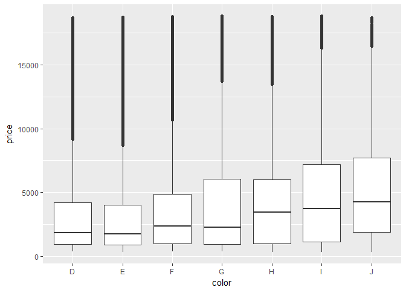

Lesson3-Univariate Problems
================

##### Keywords

file format, histogram, facet, scaling, frequency polygon

### Import libraries and read Dimond data set

``` r
library(ggplot2)
library(gridExtra)
library(tidyr)
library(dplyr)

data("diamonds")
```

### Problem 1. number of observation/variables, data types

``` r
summary(diamonds)
```

    ##      carat               cut        color        clarity     
    ##  Min.   :0.2000   Fair     : 1610   D: 6775   SI1    :13065  
    ##  1st Qu.:0.4000   Good     : 4906   E: 9797   VS2    :12258  
    ##  Median :0.7000   Very Good:12082   F: 9542   SI2    : 9194  
    ##  Mean   :0.7979   Premium  :13791   G:11292   VS1    : 8171  
    ##  3rd Qu.:1.0400   Ideal    :21551   H: 8304   VVS2   : 5066  
    ##  Max.   :5.0100                     I: 5422   VVS1   : 3655  
    ##                                     J: 2808   (Other): 2531  
    ##      depth           table           price             x         
    ##  Min.   :43.00   Min.   :43.00   Min.   :  326   Min.   : 0.000  
    ##  1st Qu.:61.00   1st Qu.:56.00   1st Qu.:  950   1st Qu.: 4.710  
    ##  Median :61.80   Median :57.00   Median : 2401   Median : 5.700  
    ##  Mean   :61.75   Mean   :57.46   Mean   : 3933   Mean   : 5.731  
    ##  3rd Qu.:62.50   3rd Qu.:59.00   3rd Qu.: 5324   3rd Qu.: 6.540  
    ##  Max.   :79.00   Max.   :95.00   Max.   :18823   Max.   :10.740  
    ##                                                                  
    ##        y                z         
    ##  Min.   : 0.000   Min.   : 0.000  
    ##  1st Qu.: 4.720   1st Qu.: 2.910  
    ##  Median : 5.710   Median : 3.530  
    ##  Mean   : 5.735   Mean   : 3.539  
    ##  3rd Qu.: 6.540   3rd Qu.: 4.040  
    ##  Max.   :58.900   Max.   :31.800  
    ## 

``` r
names(diamonds)
```

    ##  [1] "carat"   "cut"     "color"   "clarity" "depth"   "table"   "price"  
    ##  [8] "x"       "y"       "z"

``` r
dim(diamonds)
```

    ## [1] 53940    10

``` r
head(diamonds)
```

    ## # A tibble: 6 x 10
    ##   carat cut       color clarity depth table price     x     y     z
    ##   <dbl> <ord>     <ord> <ord>   <dbl> <dbl> <int> <dbl> <dbl> <dbl>
    ## 1 0.230 Ideal     E     SI2      61.5  55.0   326  3.95  3.98  2.43
    ## 2 0.210 Premium   E     SI1      59.8  61.0   326  3.89  3.84  2.31
    ## 3 0.230 Good      E     VS1      56.9  65.0   327  4.05  4.07  2.31
    ## 4 0.290 Premium   I     VS2      62.4  58.0   334  4.20  4.23  2.63
    ## 5 0.310 Good      J     SI2      63.3  58.0   335  4.34  4.35  2.75
    ## 6 0.240 Very Good J     VVS2     62.8  57.0   336  3.94  3.96  2.48

``` r
levels(diamonds$color)
```

    ## [1] "D" "E" "F" "G" "H" "I" "J"

### Problem 2. histogram

``` r
qplot(x = price, data = diamonds,
      binwidth = 200,
      color = I('black'), fill = I('blue'),
      xlab = "Price Range",
      ylab = "Number of Diamonds") +
  scale_x_continuous(breaks = seq(0, 100, 20000))
```


### Problem 3. histogram summary

``` r
summary(diamonds$price)
```

    ##    Min. 1st Qu.  Median    Mean 3rd Qu.    Max. 
    ##     326     950    2401    3933    5324   18823

From the histogram, it's long-tailed having median on the left of mean. The summary of the price supports the fact that most of the prices are centered around 0 ~ 2500.

### Problem 4. how many diamonds in a certain range

``` r
diamonds$price_range <- ifelse(diamonds$price < 250, 'cheap', 'average')
diamonds$price_range <- ifelse(diamonds$price < 500, diamonds$price_range, 'expensive')
diamonds$price_range <- ifelse(diamonds$price < 15000, diamonds$price_range, 'premium')

table(diamonds$price_range)
```

    ## 
    ##   average expensive   premium 
    ##      1729     50555      1656

### Problem 5. peak of histogram

``` r
# round the prices (e.g. 133 -> 100, 271 -> 300)
price_rounded <- round(diamonds$price, digits = -2)
# list prices and find the most found
uniq_price <- unique(price_rounded)
uniq_price[which.max(tabulate(match(price_rounded, uniq_price)))]
```

    ## [1] 700

``` r
# count the most found
length(price_rounded[price_rounded == 700])
```

    ## [1] 2881

### Problem 6. price by cut histogram

``` r
p1 <- qplot(x = price, data = subset(diamonds, cut == 'Fair'), xlab = 'Fair')
p2 <- qplot(x = price, data = subset(diamonds, cut == 'Good'), xlab = 'Good')
p3 <- qplot(x = price, data = subset(diamonds, cut == 'Very Good'), xlab = 'Very Good')
p4 <- qplot(x = price, data = subset(diamonds, cut == 'Premium'), xlab = 'Premium')
p5 <- qplot(x = price, data = subset(diamonds, cut == 'Ideal'), xlab = 'Ideal')

grid.arrange(p1, p2, p3, p4, p5)
```

    ## `stat_bin()` using `bins = 30`. Pick better value with `binwidth`.
    ## `stat_bin()` using `bins = 30`. Pick better value with `binwidth`.
    ## `stat_bin()` using `bins = 30`. Pick better value with `binwidth`.
    ## `stat_bin()` using `bins = 30`. Pick better value with `binwidth`.
    ## `stat_bin()` using `bins = 30`. Pick better value with `binwidth`.


### Problem 7. Price by cut

``` r
by(diamonds$price, diamonds$cut, summary)
```

    ## diamonds$cut: Fair
    ##    Min. 1st Qu.  Median    Mean 3rd Qu.    Max. 
    ##     337    2050    3282    4359    5206   18574 
    ## -------------------------------------------------------- 
    ## diamonds$cut: Good
    ##    Min. 1st Qu.  Median    Mean 3rd Qu.    Max. 
    ##     327    1145    3050    3929    5028   18788 
    ## -------------------------------------------------------- 
    ## diamonds$cut: Very Good
    ##    Min. 1st Qu.  Median    Mean 3rd Qu.    Max. 
    ##     336     912    2648    3982    5373   18818 
    ## -------------------------------------------------------- 
    ## diamonds$cut: Premium
    ##    Min. 1st Qu.  Median    Mean 3rd Qu.    Max. 
    ##     326    1046    3185    4584    6296   18823 
    ## -------------------------------------------------------- 
    ## diamonds$cut: Ideal
    ##    Min. 1st Qu.  Median    Mean 3rd Qu.    Max. 
    ##     326     878    1810    3458    4678   18806

### Problem 8. scale and multiple histogram

``` r
ggplot(aes(x = price), data = diamonds) +
  geom_histogram(color = 'black', fill = 'red') +
  scale_x_continuous(limits = c(0, 20000), breaks = seq(0, 20000, 1000)) +
  theme_bw(base_size = 5) +
  theme(axis.text.x = element_text(angle = 90, hjust = 1)) +
  facet_wrap(~cut, scales = 'free')
```

    ## `stat_bin()` using `bins = 30`. Pick better value with `binwidth`.


### Problem 9. price per Carat by cut

``` r
ggplot(aes(x = price/carat), data = diamonds) +
  geom_histogram(color = 'black', fill = 'blue') +
  scale_x_log10(limits = c(500, 15000), 
                breaks = scales::trans_breaks('log10', function(x) 10^x)) +
  theme_bw(base_size = 10) +
  theme(axis.text.x = element_text(angle = 90, hjust = 1)) +
  facet_wrap(~cut, scales = 'free')
```

    ## `stat_bin()` using `bins = 30`. Pick better value with `binwidth`.


### Problem 10. price box plot

``` r
# price by clarity
qplot(x = clarity, y = price,
      data = diamonds,
      geom = 'boxplot')
```


``` r
# price by cut
qplot(x = cut, y = price,
      data = diamonds,
      geom = 'boxplot')
```


``` r
# price by color
ggplot(aes(x = color, y = price), data = diamonds) +
  geom_boxplot()
```



### Problem 11. IQR

``` r
# price by color summary
IQR(subset(diamonds, color == 'D')$price)
```

    ## [1] 3302.5

### Problem 12. price per carat using box plot

``` r
qplot(x = color, y = price/carat,
      data = diamonds,
      geom = 'boxplot') +
  coord_cartesian(ylim = c(2000, 6000))
```


The best color is 'D' and the next to the right and so on, to the worst 'J' on the x-axis. Surprisingly enough, the best color seems to be less than average in median price and the worst color is one of the high median prices. And 'G' in the middle has the highest price. All these imply that the factor color is not actually influential on price of a diamond.

### Problem 13. crat frequency polygon

``` r
ggplot(aes(x = carat), data = diamonds) +
  geom_freqpoly(binwidth = 0.01)
```


``` r
table(diamonds$carat == 1.01)
```

    ## 
    ## FALSE  TRUE 
    ## 51698  2242
