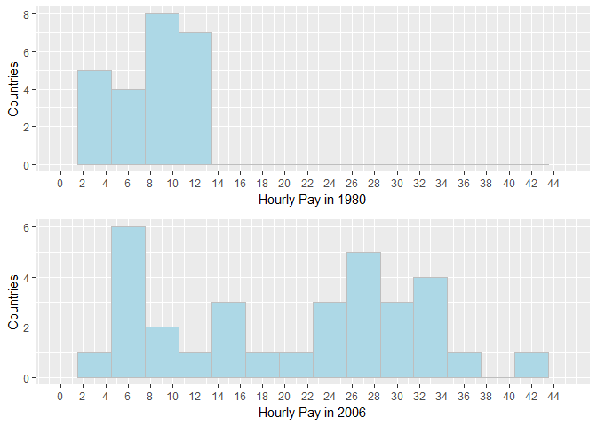
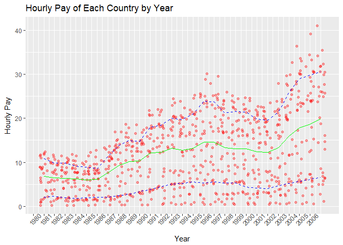
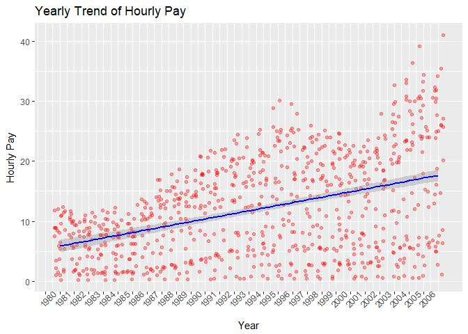
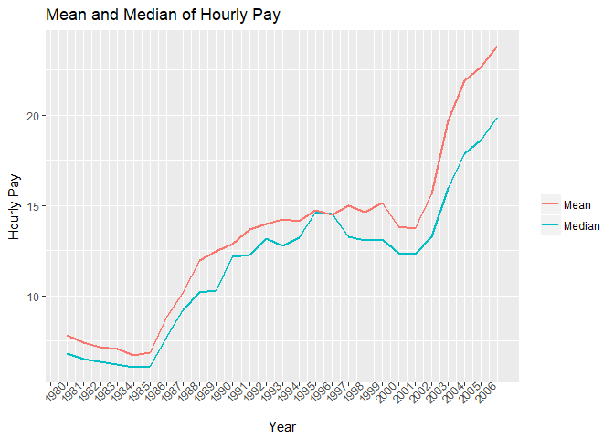
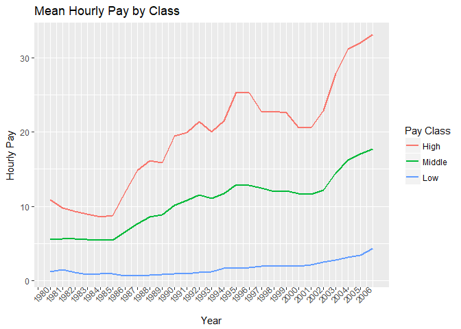

Mini-Project Series II: The History Of Hourly Pay In Countries
================

### Introduction

The series II will cover the hourly pay data in different countries. Unlike the series I, another variable 'Time' will brought to plots. Since the hourly compensation data from [Gap Minder](https://www.gapminder.org/data/) displays its values in years, they can be easily plotted by year. First, scatter plot will show all the individual values in detail and second, line plot will condense the scatter plot by statistical method like mean or median to show overall trends. As with series I, the countries will be classified into a certain group to make clear of the difference among countries.

### Import libraries

``` r
library(ggplot2)
library(gridExtra)
library(tidyr)
library(reshape2)
library(dplyr)
```

### Data from Gap Minder: [Hourly Compensation by International Labour Organization](https://docs.google.com/spreadsheets/d/1EjRPqwPTkOY4whM0V9ZS06KEcqjgUy0C4MFcyMHmngE/pub)

``` r
hourly_pay <- read.csv('../Data/indicator_hour compensation.csv')

# take care of variables
hourly_pay$X <- NULL
hourly_pay <- hourly_pay[-35, ]
colnames(hourly_pay)[1] <- "country"
summary(hourly_pay$X1997)
```

    ##    Min. 1st Qu.  Median    Mean 3rd Qu.    Max. 
    ##    0.46    5.85   14.97   13.29   19.92   25.96

### Histogram of Hourly Pay

``` r
p_1980 <- ggplot(hourly_pay, aes(X1980)) +
  geom_histogram(binwidth = 3, color = 'gray', fill = 'lightblue') +
  xlab("Hourly Pay in 1980")+ ylab("Countries") +
  scale_x_continuous(limits = c(0, 45), breaks = seq(0, 45, 2))

p_2006 <- ggplot(hourly_pay, aes(X2006)) +
  geom_histogram(binwidth = 3, color = 'gray', fill = 'lightblue') +
  xlab("Hourly Pay in 2006") + ylab("Countries") +
  scale_x_continuous(limits = c(0, 45), breaks = seq(0, 45, 2))

grid.arrange(p_1980, p_2006, ncol = 1)
```



As expected, most of the countries moved out of 0~10 USD range up to 12, 20, even over 40 USD. Interesting point is that there are more countries in 6 USD sector in 2006 than in 1980. Considering a great drop in 8~12 USD range in 2006, it is suspected that countries in 0~4 USD range in 1980 have moved up to 8 USD during which the countries in 8~12 USD range in 1980 are now dispersed onto a wide range between 14~42 USD.

### Scatter Plot of Hourly Pay by Year

``` r
hourly_pay$class <- ifelse(hourly_pay$X1997 > 20, '1_high', '2_middle')
hourly_pay$class <- ifelse(hourly_pay$X1997 <= 5, '3_low', hourly_pay$class)
```

New variable 'Class' is added for later use. The reason why 1997 is selected for basis is because there are missing data in the years before and 1997 is the first year that all the observations are available.

``` r
# years column into numerical type
colnames(hourly_pay) <- c('country', 1980:2006, 'class')
# new format 
hourly_pay <- melt(hourly_pay, id.vars = c('country', 'class'),
                           variable.name = 'year', value.name = 'hourly_pay')
hourly_pay$year <- as.numeric(hourly_pay$year) + 1980

# scatter plot with benchmark lines
hourly_pay_scatter <- ggplot(hourly_pay, aes(year, hourly_pay)) +
  geom_point(alpha = 1/3, color = 'red', position = position_jitter()) +
  geom_line(stat = 'summary', fun.y = mean, color = 'green') +
  geom_line(stat = 'summary', fun.y = quantile, fun.args = list(probs = 0.2),
            linetype = 2, color = 'blue') +
  geom_line(stat = 'summary', fun.y = quantile, fun.args = list(probs = 0.8),
            linetype = 2, color = 'blue') +
  labs(title = "Hourly Pay of Each Country by Year", x = "Year", y = "Hourly Pay")

hourly_pay_scatter + theme(axis.text.x = element_text(angle = 45)) +
  scale_x_continuous(breaks = seq(1980, 2006, 1))
```



The green line is the mean which has a gentle upward trend over time. The dotted blue line in the top area is 80% quantile. These are mostly European countries that experienced a slight drop in the late 1990's and early 2000's when the Euro system was introduced as one possible reason to explain why. Another dotted line in the bottom is 20% quantile. This has almost no slope from 1980 to 2006 but the growth is actually from somewhere around 2.5 USD to over 6 USD, roughly as same proportional jump as developed countries grew from 10 USD to 30 USD. However, the size of the gap between developed and undeveloped nations became even bigger, approximately from 8 USD in 1980 to 20 USD in 2006.

[This USD/EUR graph looks similar with the 80% quantile line in '99~'06 to get some idea](https://commons.wikimedia.org/wiki/File:USD-EUR_1999-.png)

``` r
# smoothing the scatter plot
hourly_pay_smooth <- ggplot(hourly_pay, aes(year, hourly_pay)) +
  geom_point(alpha = 1/3, color = 'red', position = position_jitter()) +
  geom_smooth(method = 'lm', color = 'blue') +
  labs(title = "Yearly Trend of Hourly Pay", x = "Year", y = "Hourly Pay")

hourly_pay_smooth + theme(axis.text.x = element_text(angle = 45)) +
  scale_x_continuous(breaks = seq(1980, 2006, 1))
```



The upward overall trend can be seen again in the graph. But the correlation between hourly pay and time is not impressively high enough. This would be probably due to the variation as the dots are spread widely.

``` r
cor.test(hourly_pay$year, hourly_pay$hourly_pay)
```

    ## 
    ##  Pearson's product-moment correlation
    ## 
    ## data:  hourly_pay$year and hourly_pay$hourly_pay
    ## t = 13.467, df = 829, p-value < 2.2e-16
    ## alternative hypothesis: true correlation is not equal to 0
    ## 95 percent confidence interval:
    ##  0.3662306 0.4779236
    ## sample estimates:
    ##       cor 
    ## 0.4236862

### Mean and Median of Hourly Pay by Year

``` r
# seek yearly mean and median
hourly_pay_by_year <- hourly_pay %>%
  group_by(year) %>%
  summarise(hourly_pay_mean = mean(hourly_pay, na.rm = T),
            hourly_pay_median = median(hourly_pay, na.rm = T)) %>%
  arrange(year)

hourly_pay_mean_median <- ggplot(hourly_pay_by_year) +
  geom_line(aes(year, hourly_pay_mean, color = 'red'), size = 1) +
  geom_line(aes(year, hourly_pay_median, color = 'blue'), size = 1) +
  labs(title = "Mean and Median of Hourly Pay", x = "Year", y = "Hourly Pay")

hourly_pay_mean_median + theme(axis.text.x = element_text(angle = 45)) +
  scale_x_continuous(breaks = seq(1980, 2006, 1)) +
  scale_color_discrete(name = "", labels = c("Mean", "Median"))
```



Judging from the mean and median lines, the distribution is positively skewed (median &lt; mean). Recall that there are some rich countries with high hourly pay when there are many with much lower hourly pay as in the histogram earlier. Another point to notice is that the gap between the mean and median has become larger in recent years. This is understood in the same sense with the previous histograms in that the quantitative disparity between developed and undeveloped nations are worse than before.

[Easy understaing of Skewness](http://www.statisticshowto.com/probability-and-statistics/skewed-distribution/)

### Line Plot of Hourly Pay by Compensation Class

``` r
# mean of hourly pay <= 5 group for each year
hourly_pay_low <- hourly_pay[hourly_pay$class == '3_low', ] %>%
  group_by(year) %>%
  summarise(hourly_mean = mean(hourly_pay, na.rm = T)) %>%
  arrange(year)
hourly_pay_low$class <- paste('3_low')

# mean of 5 < hourly pay <= 20 group for each year
hourly_pay_middle <- hourly_pay[hourly_pay$class == '2_middle', ] %>%
  group_by(year) %>%
  summarise(hourly_mean = mean(hourly_pay, na.rm = T)) %>%
  arrange(year)
hourly_pay_middle$class <- paste('2_middle')

# mean of 20 < hourly pay group for each year
hourly_pay_high <- hourly_pay[hourly_pay$class == '1_high', ] %>%
  group_by(year) %>%
  summarise(hourly_mean = mean(hourly_pay, na.rm = T)) %>%
  arrange(year)
hourly_pay_high$class <- paste('1_high')

# into one data frame for plotting
hourly_pay_by_class <- rbind(hourly_pay_low, hourly_pay_middle, hourly_pay_high)

hourly_pay_class <- ggplot(hourly_pay_by_class, aes(year, hourly_mean)) +
  geom_line(aes(color = class), size = 1) +
  labs(title = "Mean Hourly Pay by Class", x = "Year", y = "Hourly Pay")

hourly_pay_class + theme(axis.text.x = element_text(angle = 45)) +
  scale_x_continuous(breaks = seq(1980, 2006, 1)) +
  scale_color_discrete(name = "Pay Class", labels = c("High", "Middle", "Low"))
```



Recalling that the class variable is set by the hourly pay in 1997, it is noteworthy that there isn't any single cross among the 3 colored lines. This means that there hasn't been any intergroup change and it seems to be only more impossible that the low class would go up or go near to the middle or high class as time progresses to the recent years.

### Conclusion

It is a well known fact that people get paid more in developed countries and the opposite in undeveloped countries. However, it is surprising the gap between the groups are growingly bigger than ever even if all groups grew approximately triple times in 2006 compared to 1980. In short, the hourly pay groups are diverging. Another thing is well known is that the GDP/capita growth rate is usually higher in undeveloped countries. This is also what is partly found in the series I. However, the growth rate of hourly pay among countries look the same or a little higher in rich countries. To interpret the two results together, hourly pay raise didn't catch GDP/capita raise in undeveloped countries. In other words, it could be said that productivity of labor is not improved as much as economy is now bigger in these countries.
