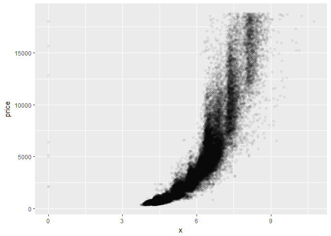
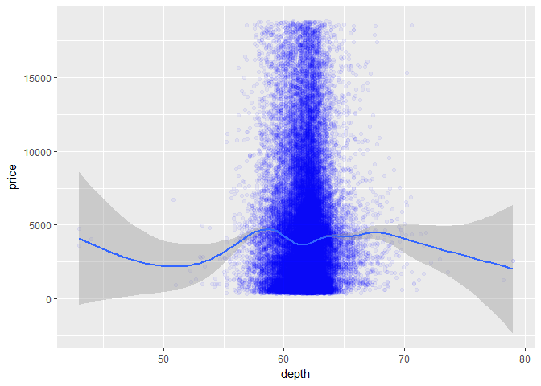
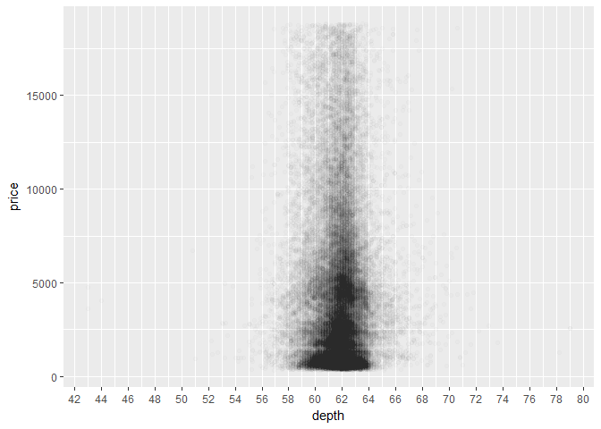
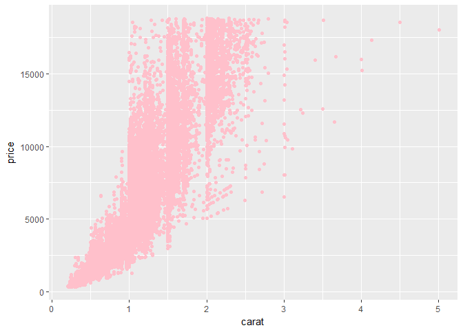
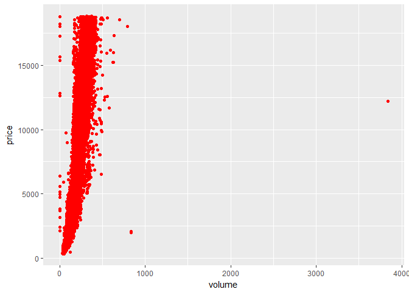
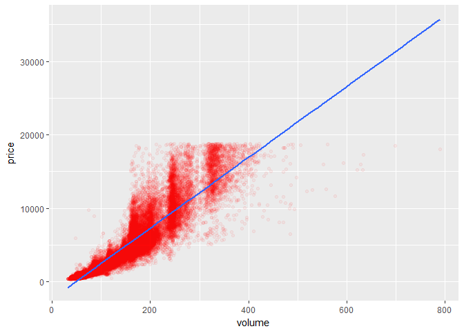
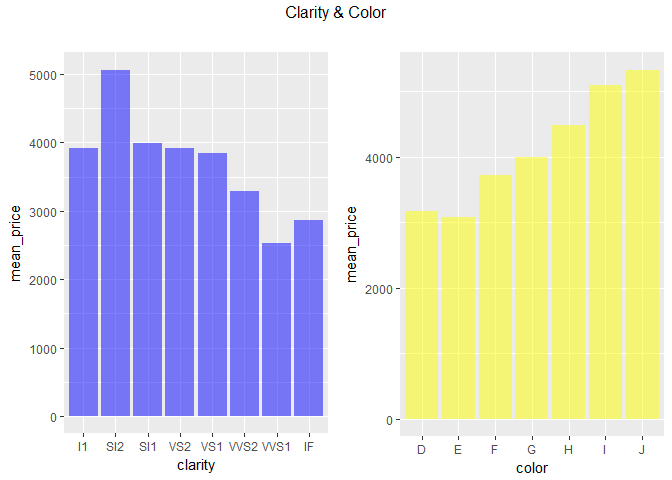

Lesson4-Bivariate Problems
================

##### Keywords

scatter plot, geom line, geom smooth, jitter, fun.y, group by, cor.test

### Import libraries and read Dimond data set

``` r
library(ggplot2)
library(plyr)
library(dplyr)
library(gridExtra)

summary(diamonds)
```

    ##      carat               cut        color        clarity     
    ##  Min.   :0.2000   Fair     : 1610   D: 6775   SI1    :13065  
    ##  1st Qu.:0.4000   Good     : 4906   E: 9797   VS2    :12258  
    ##  Median :0.7000   Very Good:12082   F: 9542   SI2    : 9194  
    ##  Mean   :0.7979   Premium  :13791   G:11292   VS1    : 8171  
    ##  3rd Qu.:1.0400   Ideal    :21551   H: 8304   VVS2   : 5066  
    ##  Max.   :5.0100                     I: 5422   VVS1   : 3655  
    ##                                     J: 2808   (Other): 2531  
    ##      depth           table           price             x         
    ##  Min.   :43.00   Min.   :43.00   Min.   :  326   Min.   : 0.000  
    ##  1st Qu.:61.00   1st Qu.:56.00   1st Qu.:  950   1st Qu.: 4.710  
    ##  Median :61.80   Median :57.00   Median : 2401   Median : 5.700  
    ##  Mean   :61.75   Mean   :57.46   Mean   : 3933   Mean   : 5.731  
    ##  3rd Qu.:62.50   3rd Qu.:59.00   3rd Qu.: 5324   3rd Qu.: 6.540  
    ##  Max.   :79.00   Max.   :95.00   Max.   :18823   Max.   :10.740  
    ##                                                                  
    ##        y                z         
    ##  Min.   : 0.000   Min.   : 0.000  
    ##  1st Qu.: 4.720   1st Qu.: 2.910  
    ##  Median : 5.710   Median : 3.530  
    ##  Mean   : 5.735   Mean   : 3.539  
    ##  3rd Qu.: 6.540   3rd Qu.: 4.040  
    ##  Max.   :58.900   Max.   :31.800  
    ## 

### Problem 1.scatter plot of price vs. x

``` r
ggplot(diamonds, aes(x, price)) +
  geom_point(alpha = 1/20)
```



### Problem 2. analysis of the scatter plot

As x becomes larger, price goes up in exponential trend. Also, it seems that most of the observations are situated in the lower price and smaller x zone.

### Problem 3. correlations

``` r
corr_x <- with(diamonds, cor.test(price, x))
corr_y <- with(diamonds, cor.test(price, y))
corr_z <- with(diamonds, cor.test(price, z))

sprintf("X: %f, Y: %f, Z: %f", corr_x$estimate, corr_y$estimate, corr_z$estimate)
```

    ## [1] "X: 0.884435, Y: 0.865421, Z: 0.861249"

### Problem 4. scatter plot of price vs. depth

``` r
ggplot(diamonds, aes(depth, price)) +
  geom_point(alpha = 1/20, color = 'blue') +
  geom_smooth()
```



### Problem 5. alpha and breaks to the scatter plot of price vs. x

``` r
ggplot(data = diamonds, aes(depth, price)) + 
  geom_point(alpha = 1/100) +
  scale_x_continuous(breaks = seq(0, 80, 2))
```



### Problem 6. typical depth range

Range: \[58, 64\]

### Problem 7. correlation of price vs. depth

``` r
corr_depth <- with(diamonds, cor.test(price, depth))

sprintf("Price-Depth: %f", corr_depth$estimate)
```

    ## [1] "Price-Depth: -0.010647"

The correlation between two are almost zero, which provides no information.

### Problem 8. scatter plot of price vs. carat

``` r
ggplot(diamonds, aes(carat, price)) +
  geom_point(color = 'pink')
```



### Problem 9. scatter plot of price vs. volume (new variable)

``` r
diamonds$volume <- diamonds$x * diamonds$y * diamonds$z

ggplot(diamonds, aes(volume, price)) +
  geom_point(color = 'red')
```



### Problem 10. interpreting price vs. volume

The price vs. volume is in proportional relationship with the limited number of outliers. With the sharp slope, the price goes up a lot for every unit increment of the volume.

##### Extra Note. diamonds with 0 volume

``` r
count(diamonds[diamonds$volume == 0, ])
```

    ## # A tibble: 1 x 1
    ##       n
    ##   <int>
    ## 1    20

### Problem 11. correlation of price vs. volume

``` r
corr_volume <- with(subset(diamonds, volume != 0 & volume <= 800),
                    cor.test(price, volume))

sprintf("Price-Volume: %f", corr_volume$estimate)
```

    ## [1] "Price-Volume: 0.923546"

### Problem 12. adjustment for price vs. volume

``` r
ggplot(subset(diamonds, (volume != 0 & volume <= 800)), aes(volume, price)) +
  geom_point(alpha = 1/20, color = 'red') +
  geom_smooth(method = 'lm')
```



linear model represents the plot properly because the correlation between two variables are very high.

### Problem 13. mean price by clarity

``` r
diamonds_by_clarity <- diamonds %>%
  group_by(clarity) %>%
  summarise(mean_price = mean(price), median_price = median(price),
            min_price = min(price), max_price = max(price), n = n()) %>%
  arrange(clarity)

head(diamonds_by_clarity)
```

    ## # A tibble: 6 x 6
    ##   clarity mean_price median_price min_price max_price     n
    ##   <ord>        <dbl>        <dbl>     <dbl>     <dbl> <int>
    ## 1 I1            3924         3344       345     18531   741
    ## 2 SI2           5063         4072       326     18804  9194
    ## 3 SI1           3996         2822       326     18818 13065
    ## 4 VS2           3925         2054       334     18823 12258
    ## 5 VS1           3839         2005       327     18795  8171
    ## 6 VVS2          3284         1311       336     18768  5066

### Problem 14. multiple bar plots of clarity and color

``` r
diamonds_by_clarity <- group_by(diamonds, clarity)
diamonds_mp_by_clarity <- summarise(diamonds_by_clarity, mean_price = mean(price))

diamonds_by_color <- group_by(diamonds, color)
diamonds_mp_by_color <- summarise(diamonds_by_color, mean_price = mean(price))

p_clarity <- ggplot(diamonds_mp_by_clarity, aes(clarity, mean_price)) +
  geom_col(fill = 'blue', alpha = 0.5)

p_color <- ggplot(diamonds_mp_by_color, aes(color, mean_price)) +
  geom_col(fill = 'yellow', alpha = 0.5)

grid.arrange(p_clarity, p_color, ncol = 2, top = "Clarity & Color\n")
```



### Problem 15. analysis of the bar plots

First, we should note that clarity and color are such categorical data that we can't obtain correlation directly. This is why we drew the bar plots for the mean price of each grade to capture a trend visually. Surprisingly enough, both the clarity and the color show no specific pattern. The clarity has some ups & downs but the color has some trend that it becomes more expensive as the grade goes down; color 'J' is worst but priced the highest. The clarity has a similar pattern but as strong. In conclusion, both the clarity and the color have some negative relationship with the price unlike our expectation and the color seems to have stronger influences on the price.
