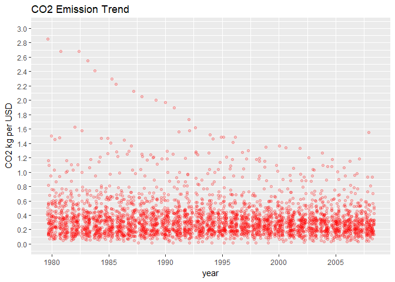
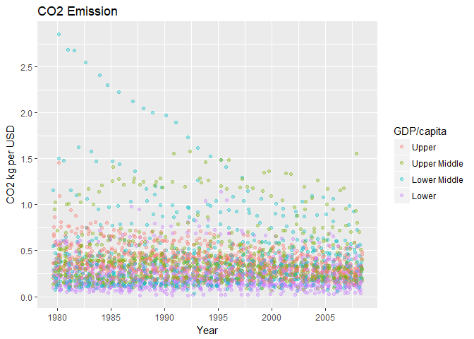

Mini-Project Series III: CO2 kg Per USD And The Relationship With GDP/capita
================

### Introduction

CO2 emission has been an issue for a long time since people started to raise concerns about the climate change. Total CO2 emission keeps increasing as a result of developing economy. For that reason, CO2 kg per USD could be a great measure to take into account how each country makes a contribution to controlling CO2 emission while it develops the economy. Utilizing the data set from [Gap Minder](https://www.gapminder.org/data/), I will first see how countries are distributed with CO2 kg per USD to find some changes in the past and now. Then, I will make use of scatter plot, based on which I will investigate certain countries and why they are showing the patterns. Lastly, I will group them by income class and study the relationship between CO2 kg per USD and GDP/capita.

### Import libraries

``` r
library(ggplot2)
library(tidyr)
library(dplyr)
library(gridExtra)
library(reshape2)
```

### Data from Gap Minder: [CO2 kg per PPP dollor of GDP by World Bank](https://docs.google.com/spreadsheets/d/1a3-FXvfRGg0TFl-oUAHRWDQyogdaZag-AjGWBlT4GRg/pub)

``` r
co2_per_usd <- read.csv('../Data/co2 kg per USD.csv')
co2_per_usd <- co2_per_usd[, -c(2:21, 51:53)]
co2_per_usd <- drop_na(co2_per_usd)
colnames(co2_per_usd)[1] <- 'country'
```

Along with the CO2 kg per USD data, I will reuse the GDP/capita data from Series I. The purpose is to investigate CO2 kg per USD trend by GDP/capita class in the later part of the study.

[PPP](http://www.who.int/choice/costs/ppp/en/)

``` r
gdp_capita <- read.csv('../Data/GDPpercapitaconstant2000US.csv')
gdp_capita <- gdp_capita[, c(1, 53)]
gdp_capita <- drop_na(gdp_capita)
colnames(gdp_capita)[1] <- 'country'
```

As explained above, all I need from the data set this time is groups by GDP/capita. I have GDP/capita in 2011 based for grouping. This is merged with the main data set by country names, by doing which the preparation ends here and data exploring begins in the next.

``` r
gdp_capita$income_class <- ifelse(gdp_capita$X2011 > 12000, "1_upper",
                                  "2_upper_middle")
gdp_capita$income_class <- ifelse(gdp_capita$X2011 < 3000, "3_lower_middle",
                               gdp_capita$income_class)
gdp_capita$income_class <- ifelse(gdp_capita$X2011 < 1000, "4_lower",
                               gdp_capita$income_class)
gdp_capita <- gdp_capita[-2]

co2_per_usd <- merge(x = co2_per_usd, y = gdp_capita, by = 'country')
```

### Histogram of CO2 kg per USD in 1980 vs 2008

``` r
co2_per_usd_1980 <- ggplot(co2_per_usd, aes(X1980)) +
  geom_histogram(binwidth = 1/20, color = 'gray', fill = 'lightblue') +
  labs(title = "CO2 Emission per USD in 1980", x = "CO2 kg per USD", y = "Countries") +
  scale_x_continuous(limits = c(0, 1.8), breaks = seq(0, 1.8, 0.1)) +
  scale_y_continuous(limits = c(0, 22), breaks = seq(0, 22, 2))

co2_per_usd_2008 <- ggplot(co2_per_usd, aes(X2008)) +
  geom_histogram(binwidth = 1/20, color = 'gray', fill = 'lightblue') +
  labs(title = "CO2 Emission per USD in 2008", x = "CO2 kg per USD", y = "Countries") +
  scale_x_continuous(limits = c(0, 1.8), breaks = seq(0, 1.8, 0.1)) +
  scale_y_continuous(limits = c(0, 22), breaks = seq(0, 22, 2))

grid.arrange(co2_per_usd_1980, co2_per_usd_2008, ncol = 1)
```


Many of the countries have moved within 0.4 kg range after about three decades. Especially the number of countries ranged between 0.15 kg and 0.25 kg increased remarkably when the counts of 0.1 kg and less stayed almost the same. The situation in over 0.7 kg has improved a bit with counts decreased but their share from the total is so small as to be negligible. This all implies that the change during the period is mostly from the shift in the range of 0.15 kg to 0.45 kg.

``` r
co2_per_usd_2008 + xlab("CO2 kg per USD in Log") + scale_x_log10() +
  scale_y_continuous(limits = c(0, 15), breaks = seq(0, 15, 5))
```

    ## Scale for 'x' is already present. Adding another scale for 'x', which
    ## will replace the existing scale.

    ## Scale for 'y' is already present. Adding another scale for 'y', which
    ## will replace the existing scale.


Put into the log format, it looks more normalized than the original. This suggests that the original form is positively skewed, that is, many of the countries are gathered in the left of the histogram. Easily speaking, most of the countries emit small amounts of CO2 kg per USD. This can be understood not only by the histograms but by statistics as below.

``` r
summary_1980 <- summary(co2_per_usd$X1980)
summary_2008 <- summary(co2_per_usd$X2008)

cat("\tMin\t   1st Qu.   Median    Mean\t3rd Qu.\t  Max\n", "1980: ",
    summary_1980, "\n\n", "2008: ", summary_2008)
```

    ##  Min    1st Qu.   Median    Mean 3rd Qu.   Max
    ##  1980:  0.06367261 0.2051299 0.3195136 0.4052808 0.5153259 2.853803 
    ## 
    ##  2008:  0.03681972 0.1729937 0.2507377 0.2987366 0.3393254 1.552863

In both years, the medians are smaller than the means to prove them positively skewed. The numbers in the statistics of 2008 all decreased down from those of 1980. This seems to be good news to the environment, however, there is a need of further examinations to figure how it is improved.

Scatter Plot of CO2 kg per USD by Year
======================================

``` r
# transition year variables to values
co2_per_usd_melt <- co2_per_usd
colnames(co2_per_usd_melt) <- c('country', 1980:2008, 'income_class')
co2_per_usd_melt <- melt(co2_per_usd_melt, 
                         id.vars = c('country', 'income_class'),
                         variable.name = 'year', 
                         value.name = 'co2')
# show it in a proper year format
co2_per_usd_melt$year <- as.numeric(co2_per_usd_melt$year) + 1979

co2_per_usd_scatter <- ggplot(co2_per_usd_melt, aes(year, co2)) +
  geom_point(color = 'red', alpha = 1/5, position = position_jitter()) +
  labs(title = "CO2 Emission Trend", y ="CO2 kg per USD")

co2_per_usd_scatter + scale_x_continuous(breaks = seq(1980, 2008, 5)) +
  scale_y_continuous(limits = c(0, 3), breaks = seq(0, 3, 0.2))
```



To involve the year variable, the data set should be reshaped. The melt function transitions variables into values so a wide matrix can be narrowed down in width. After this process, I have the scatter plot showing most of the dots under 0.5. This accords with the guess from the histogram that most of the countries fall within small amount of CO2 emission. But there are still some exceptions in the top area. These can be explained by specifying certain values.

``` r
countries_over_1.0_1980 <- co2_per_usd[co2_per_usd$X1980 >= 1.0, 1]
countries_over_1.0_1995 <- co2_per_usd[co2_per_usd$X1995 >= 1.0, 1]
countries_over_1.0_2008 <- co2_per_usd[co2_per_usd$X2008 >= 1.0, 1]

cat(" [Countries over 1.0 CO2 kg per USD in 1980]\n", 
    as.character(countries_over_1.0_1980), "\n\n",
    "[Countries over 1.0 CO2 kg per USD in 1995]\n",
    as.character(countries_over_1.0_1995), "\n\n",
    "[Countries over 1.0 CO2 kg per USD in 2008]\n",
    as.character(countries_over_1.0_2008), "\n\n")
```

    ##  [Countries over 1.0 CO2 kg per USD in 1980]
    ##  Bahamas Bulgaria China Luxembourg Romania Trinidad and Tobago 
    ## 
    ##  [Countries over 1.0 CO2 kg per USD in 1995]
    ##  Bulgaria China Liberia South Africa Trinidad and Tobago 
    ## 
    ##  [Countries over 1.0 CO2 kg per USD in 2008]
    ##  Trinidad and Tobago

The most noticeable country is [Trinidad and Tobago](https://en.wikipedia.org/wiki/Economy_of_Trinidad_and_Tobago) appearing in all three queries. Industry accounts for almost half the country's economy and the biggest sector of Trinidad and Tobago industry is related to energy such as petroleum, natural gas, and chemical production. This must have a connection with air quality in the Carribean islands. Unlike the expectation that China is known for the largest CO2 emission, the country is not seen in the list of 2008 and this led me to a further investigation. According to the [Total CO2 amount emission in China](https://en.wikipedia.org/wiki/List_of_countries_by_carbon_dioxide_emissions#/media/File:Carbon_dioxide_emissions_due_to_consumption_in_China.png), the amount increased almost in all periods with a sharp rise after year 2000. This provides an idea that China economically grew quickly enough for a much higher PPP. It is reasonable to speculate that China developed industries and suceeded to grow the economy to overcome a great deal of CO2 emission. Another country to look into is Bulgaria. I noticed that the neighboring country, Romania was also one of the heavy CO2 emission countries in 80's and broadened the investigation to Eastern Europe. What I found is that these countries were under control of the Soviet Union at that time. The union aggressively built tons of factories in the [Balkans](https://en.wikipedia.org/wiki/Balkans) and manufactured massive products as the name of planned economy. Especially, a number of power plants and metallurgical smelters were built in [Bulgaria](https://en.wikipedia.org/wiki/Industry_of_Bulgaria) that later came to a stop with other manufacturing plants for a long time due to the dismissal of the Communist Regime.

``` r
# how much reduced in 1980~2008
co2_per_usd$reduction_rate <- with(co2_per_usd, (X2008-X1980)/X1980)

# median, top and bottom 10
median_reduction_rate <- median(co2_per_usd$reduction_rate)
most_reduction_countries <- head(arrange(co2_per_usd, reduction_rate), n = 10)
most_reduction_countries <- most_reduction_countries[, c("country", 
                                                         "reduction_rate")]
least_reduction_countries <- head(arrange(co2_per_usd, desc(reduction_rate)), n = 10)
least_reduction_countries <- least_reduction_countries[, c("country",
                                                           "reduction_rate")]

cat("Median reduction rate: ", median_reduction_rate)
```

    ## Median reduction rate:  -0.1944259

This reduction rate is very rough because deviations between years are not factored. Nonetheless, it can be a useful measure to get a sense of how much countries reduced CO2 on the whole. The median statistics of reduction rate is 19.4% in the 28 years.

``` r
print(most_reduction_countries)
```

    ##       country reduction_rate
    ## 1     Bahamas     -0.8552291
    ## 2   Singapore     -0.8391151
    ## 3       Gabon     -0.7781105
    ## 4  Mozambique     -0.7777558
    ## 5  Luxembourg     -0.7328447
    ## 6      Zambia     -0.7008399
    ## 7     Romania     -0.6778880
    ## 8       China     -0.6743583
    ## 9      Sweden     -0.6342514
    ## 10   Bulgaria     -0.6314058

The top five countries are small and/or young and they are relatively wealthy in their region except for Mozambique which has very low GDP for the population size along with its neighboring country Zambia ranked at 6. After their rapid economic growth, these countries successfully transitioned their industry structure from manufacturing to tourism or finance which led to reducing the total CO2 emission.

[Economy of Singapore](https://en.wikipedia.org/wiki/Economy_of_Singapore)

``` r
print(least_reduction_countries)
```

    ##                 country reduction_rate
    ## 1            Seychelles      1.9794479
    ## 2                 Benin      1.7324271
    ## 3           Congo, Rep.      0.9160999
    ## 4                 Nepal      0.8850480
    ## 5               Grenada      0.7053613
    ## 6            Bangladesh      0.6845931
    ## 7  United Arab Emirates      0.6510784
    ## 8             Mauritius      0.6446538
    ## 9              Honduras      0.6218204
    ## 10         Saudi Arabia      0.5804441

Seychelles, Grenada, and Mauritius are small countries with a common history that they became independent from western countries in the 1960~1970's. Another aspect in common is that they are all islands having their decent economy largely dependent on tourism. So, I could reach to an assumption that the rises of CO2 emission for these three are not from manufacturing industry but something else like regulations. I found that they are very similar with the Bahamas in that they are all non-annex parties to the [UNFCCC](https://en.wikipedia.org/wiki/List_of_parties_to_the_United_Nations_Framework_Convention_on_Climate_Change). However, I also learned that only the Bahamas is geographically close to a developed country, the USA, while Seychelles and Mauritius are off the African continent, Grenada very close to Trinidad and Tobago in the Carribean ocean. In fact, the Bahamas is extremely dependent on the USA for the trade and this might have influenced on the islands' CO2 control initiatives. Benin and Republic of Congo are countries in Africa, both exporting oil just like the UAE and Saudi Arabia. Nepal and Bangladesh are developing very quickly after the end of the 20th century.

[Bahamas Trade](https://atlas.media.mit.edu/en/profile/country/bhs/)

### Mean and Median of CO2 kg per USD by Year

``` r
co2_per_usd_year <- co2_per_usd_melt %>%
  group_by(year) %>%
  summarise(co2_mean = mean(co2), co2_median = median(co2)) %>%
  arrange(year)

co2_per_usd_line <- ggplot(co2_per_usd_year) +
  geom_line(aes(x = year, y = co2_mean, color = 'blue')) +
  geom_line(aes(x = year, y = co2_median, color = 'green')) +
  labs(title = "CO2 Emission Mean and Median", x = "Year", y = "CO2 kg per USD")

co2_per_usd_line + scale_color_discrete(name = NULL, labels = c("Mean", "Median"))
```


Once again, the fact that the mean is above the median is telling that the distribution is skewed with certain countries emitting a lot of CO2 kg per USD. Both the lines are going down as time progresses, though. Now that it looks evident that the relationship between CO2 kg per USD and year, the correlation comes as below. They are highly related in that the environment is improved.

``` r
corr_co2_time_mean <- with(co2_per_usd_year, cor.test(year, co2_mean))
cat("Correlation Between CO2 and Time: ", corr_co2_time_mean$estimate)
```

    ## Correlation Between CO2 and Time:  -0.9374548

### Income Class and CO2 kg per USD

``` r
co2_per_usd_gdp_capita_scatter <- ggplot(co2_per_usd_melt, aes(year, co2)) +
  geom_point(aes(color = income_class), alpha = 1/3, 
             position = position_jitter()) +
  labs(title = "CO2 Emission", x = "Year", y ="CO2 kg per USD")

co2_per_usd_gdp_capita_scatter + scale_x_continuous(breaks = seq(1980, 2008, 5)) +
  scale_y_continuous(breaks = seq(0, 3, 0.5)) +
  scale_color_discrete(name = "GDP/capita", 
                       labels = c("Upper", "Upper Middle", "Lower Middle", "Lower"))
```



Most of the developed countries are deeply involved in the climate change treaties. This should be why I see pink dots (Upper) around y = 0.5. However, these rich countries are the ones that consume the most energy resources and this could explain why pink dots are not under a certain level and purple dots (Lower) are right above the bottom. Middle classes are spread but almost every above 1.0 is green (Upper Middle) or blue (Lower Middle). These countries have been developing so fast that they must have built a number of factories and still continue to do so. They didn't have to make contributions to CO2 reduction as observers of climate change associations.

``` r
co2_per_usd_gdp_capita_facet <- co2_per_usd_melt %>%
  group_by(year, income_class) %>%
  summarise(co2_mean = mean(co2)) %>%
  arrange(year)

co2_per_usd_gdp_capita_facet_line <- ggplot(co2_per_usd_gdp_capita_facet) +
  geom_line(aes(x = year, y = co2_mean)) +
  facet_wrap(~income_class, labeller = as_labeller(c("1_upper" = "Upper",
                                            "2_upper_middle" = "Upper Middle",
                                            "3_lower_middle" = "Lower Middle",
                                            "4_lower" = "Lower"))) +
  labs(title = "CO2 Emission by GDP/capita Group", x = "Year", y = "CO2 kg per USD")

co2_per_usd_gdp_capita_facet_line + scale_x_continuous(breaks = seq(1980, 2008, 5))
```


The facet plots help a lot to understand which group made how much contributions. First, Upper class made the most dedication to reducing CO2 kg per USD. This must be because they had enough wealth to make changes after climate regulations took effect. As for Lower Middle class with the declining trend, they are mostly Latin American countries of which the GDP has not been enlarged as much. It can be inferred from this that the decline in Lower Middle class is likely from sluggish growth which led to relatively less CO2 emission. On the contrary, Upper Middle class obviously with no change are mostly East Asian countries of which the GDP have expanded a lot in the period. Lastly, Lower class showing the similar pattern with Upper Middle class are undeveloped nations. They have been always countries with the least CO2 emission per USD, suggesting that their economy has not grown that much.

[EU/East Asis/Latin America Comparison from World Bank Data](https://data.worldbank.org/?locations=ZJ-EU-4E)

### Conclusion

I looked into how CO2 kg per USD is distributed by country and by GDP/capita group. First thing I found is that most nations are under a certain level while only a small number of them is over the level, pulling the mean up. The second is that it seems like there are patterns of CO2 kg per USD depending on income class, that is, developed countries decreased it while developing countries remained the same. Some developing countries showed improvement but presumably due to slow development.
