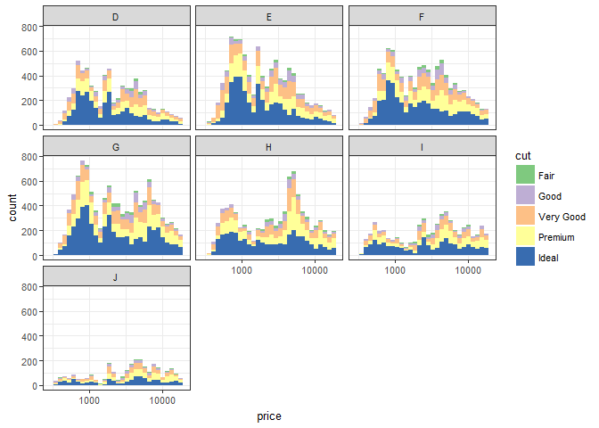

Lesson5-Multivariate Problems
================

##### Keywords

point plot, pair plot, cutting range, reshaping (dcast, melt)

``` r
library(ggplot2)
library(reshape2)
```

### Problem 1. histogram by color

``` r
ggplot(diamonds, aes(price)) +
  geom_histogram(aes(fill = cut)) +
  facet_wrap( ~ color) +
  scale_fill_brewer(type = 'qual') +
  scale_x_log10() +
  theme_bw(base_size = 10)
```



### Problem 2. scatter plot of price vs. table

``` r
ggplot(diamonds, aes(table, price)) +
  geom_point(aes(color = cut), alpha = 1/5)
```


### Problem 3. table range by cut

``` r
summary(diamonds$table, by = cut)
```

    ##    Min. 1st Qu.  Median    Mean 3rd Qu.    Max. 
    ##   43.00   56.00   57.00   57.46   59.00   95.00

### Problem 4. scatter plot of price vs. volume

``` r
diamonds$volume <- with(diamonds, x * y * z)

ggplot(subset(diamonds, volume <= quantile(volume, probs = 0.99)), 
       aes(volume, price)) +
  geom_point(aes(color = clarity)) +
  scale_y_log10()
```


### Problem 5. proportions of friend initiated

``` r
pf <- read.delim('../Data/pseudo_facebook.tsv')

pf$prop_initiated <- with(pf, friendships_initiated / friend_count)
```

### Problem 6. line graph of median proportion of friend

``` r
pf$year_joined <- floor(2014 - pf$tenure / 365)
pf$year_joined.bucket <- cut(pf$year_joined, breaks = c(2004, 2009, 2011, 2012))

ggplot(pf, aes(tenure, prop_initiated)) +
  geom_line(aes(color = year_joined.bucket), 
            stat = 'summary', fun.y = median)
```


### Problem 7. smoothing the graph

``` r
ggplot(pf, aes(tenure, prop_initiated)) +
  geom_smooth(aes(color = year_joined.bucket))
```


### Problem 8~9. data analysis

``` r
mean(subset(pf, year_joined.bucket == '(2012,2014]' &
              !is.na(prop_initiated))$prop_initiated)
```

    ## [1] NaN

Because they joined later, there were already so many other members before them that the newcomers had these existing members to send friendship requests to while the other members already had enough number of friends.

### Problem 10. scatter plot of price/carat ratio

``` r
ggplot(diamonds, aes(cut, price / carat)) +
  geom_point(aes(color = color), 
             position = position_jitter(),
             pch = 1) +
  facet_wrap( ~ clarity) +
  theme_bw(base_size = 10)
```


